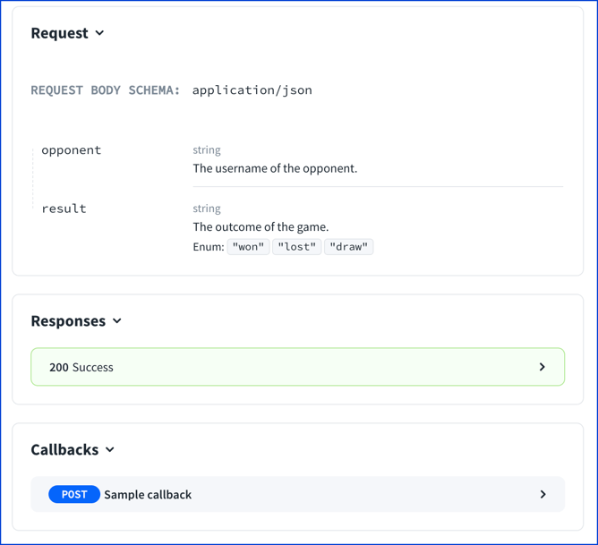

# Callback Object

<details>
<summary>
Excerpt from the OpenAPI 3.1 specification about the Callback object
</summary>

## Callback Object

A map of possible out-of band callbacks related to the parent operation.
Each value in the map is a [Path Item Object](./path-item.md) that describes a set of requests that may be initiated by the API provider and the expected responses.
The key value used to identify the path item object is an expression, evaluated at runtime, that identifies a URL to use for the callback operation.

To describe incoming requests from the API provider independent from another API call, use the [`webhooks`](./webhooks.md) field.

### Patterned Fields

Field Pattern | Type | Description
---|:---:|---
{expression} | [Path Item Object](./path-item.md) \| [Reference Object](./reference.md) | A Path Item Object, or a reference to one, used to define a callback request and expected responses.  A complete example is available.

This object MAY be extended with [Specification Extensions](./specification-extensions.md).

### Key Expression

The key that identifies the [Path Item Object](./path-item.md) is a runtime expression that can be evaluated in the context of a runtime HTTP request/response to identify the URL to be used for the callback request.
A simple example might be `$request.body#/url`.
However, using a runtime expression the complete HTTP message can be accessed.
This includes accessing any part of a body that a JSON Pointer [RFC6901](https://tools.ietf.org/html/rfc6901) can reference.

For example, given the following HTTP request:

```http
POST /subscribe/myevent?queryUrl=https://clientdomain.com/stillrunning HTTP/1.1
Host: example.org
Content-Type: application/json
Content-Length: 187

{
  "failedUrl" : "https://clientdomain.com/failed",
  "successUrls" : [
    "https://clientdomain.com/fast",
    "https://clientdomain.com/medium",
    "https://clientdomain.com/slow"
  ]
}

201 Created
Location: https://example.org/subscription/1
```

The following examples show how the various expressions evaluate, assuming the callback operation has a path parameter named `eventType` and a query parameter named `queryUrl`.

Expression | Value
---|:---
$url | https://example.org/subscribe/myevent?queryUrl=https://clientdomain.com/stillrunning
$method | POST
$request.path.eventType | myevent
$request.query.queryUrl | https://clientdomain.com/stillrunning
$request.header.content-Type | application/json
$request.body#/failedUrl | https://clientdomain.com/failed
$request.body#/successUrls/2 | https://clientdomain.com/medium
$response.header.Location | https://example.org/subscription/1


### Callback Object Examples

The following example uses the user provided `queryUrl` query string parameter to define the callback URL.  This is an example of how to use a callback object to describe a WebHook callback that goes with the subscription operation to enable registering for the WebHook.

```yaml
myCallback:
  '{$request.query.queryUrl}':
    post:
      requestBody:
        description: Callback payload
        content:
          'application/json':
            schema:
              $ref: '#/components/schemas/SomePayload'
      responses:
        '200':
          description: callback successfully processed
```

The following example shows a callback where the server is hard-coded, but the query string parameters are populated from the `id` and `email` property in the request body.

```yaml
transactionCallback:
  'http://notificationServer.com?transactionId={$request.body#/id}&email={$request.body#/email}':
    post:
      requestBody:
        description: Callback payload
        content:
          'application/json':
            schema:
              $ref: '#/components/schemas/SomePayload'
      responses:
        '200':
          description: callback successfully processed
```

</details>

## Visuals

```yaml
paths:
  /:
    post:
      summary: Sample API
      description: Sample API description.
      callbacks:
        result:
          $ref: "#/components/callbacks/resultCallback"
components:
  callbacks:
    resultCallback:
      '{$url}':
        post:
          summary: Sample callback
          requestBody:
            description: Callback payload
            content:
              'application/json':
                schema:
                  $ref: '#/components/schemas/ChessResult'
          responses:
            '200':
              description: callback successfully processed
```



## Types

- NamedCallbacks
- Callback

```ts
Callback: mapOf('PathItem')
```
