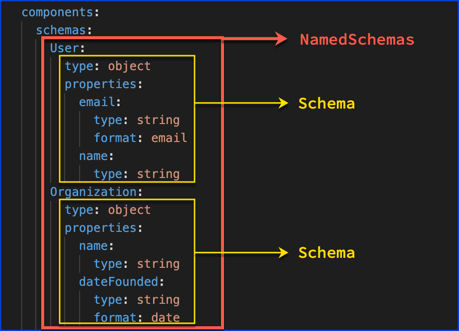

# `components`

> Holds a set of reusable objects for different aspects of the OAS. All objects defined within the components object will have no effect on the API unless they are explicitly referenced from properties outside the components object.

These are the types of components:

- [schemas](./schemas.md)
- [responses](./response.md)
- [parameters](./parameters.md)
- [examples](./example.md)
- [requestBodies](./request-body.md)
- [headers](./header.md)
- [securitySchemes](./security-schemes.md)
- [links](./links.md)
- [callbacks](./callbacks.md)
- [pathItems](./paths.md) (added in OAS 3.1)

## Named components map

Components are defined using named map keys.

The following example shows named schemas `User` and `Organization`:

```yaml
components:
  schemas:
    User:
      type: object
      properties:
        email:
          type: string
          format: email
        name:
          type: string
    Organization:
      type: object
      properties:
        name:
          type: string
        dateFounded:
          type: string
          format: date
        address:
          type: object
          properties:
            streetLine1:
              type: string
            streetLine2:
              type: string
            streetLine3:
              type: string
            city:
              type: string
            state:
              type: string
            zip:
              type: string
            country:
              type: string
```



Then, use components with a `$ref` (reference object).

```yaml
components:
  schemas:
    # ...
    Job:
      type: object
      properties:
        title:
          type: string
        startDate:
          type: string
          format: date
        person:
          $ref: '#/components/schemas/User'
```

The reference object enables reuse.

The components object is a convenient place to store objects for reuse within a single file.
You can also reference other files or even remote URLs.
Read more about that in Redocly's [reference objects guide](https://redocly.com/docs/resources/ref-guide/).

## Visuals

See the individual component types for visuals.

## Types

- Components
- NamedParameters
- NamedSchemas
- NamedResponses
- NamedExamples
- NamedRequestBodies
- NamedHeaders
- NamedSecuritySchemes
- NamedLinks
- NamedCallbacks

```ts
const Components: NodeType = {
  properties: {
    parameters: 'NamedParameters',
    schemas: 'NamedSchemas',
    responses: 'NamedResponses',
    examples: 'NamedExamples',
    requestBodies: 'NamedRequestBodies',
    headers: 'NamedHeaders',
    securitySchemes: 'NamedSecuritySchemes',
    links: 'NamedLinks',
    callbacks: 'NamedCallbacks',
  },
};
```
