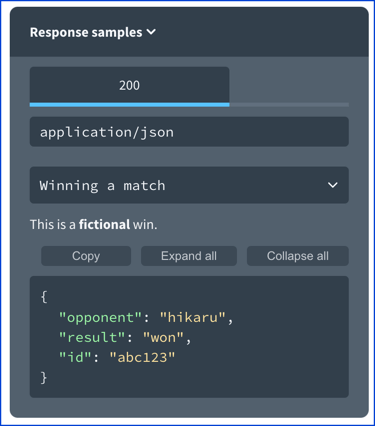
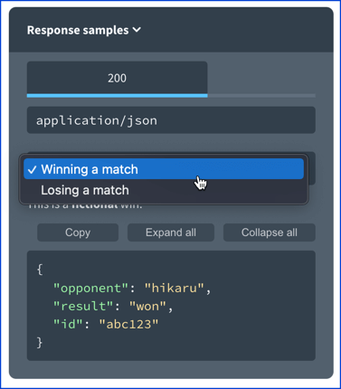
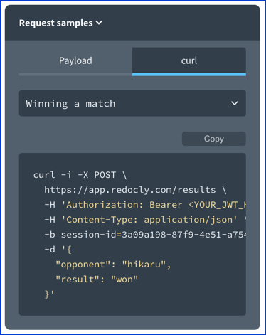

# Example Object

The example object is a reusable object and may be defined in components (named examples), separate files, or used directly in [Media Type Objects](./media-type.md).

<details>
<summary>
Excerpt from the OpenAPI 3.1 specification about the example object
</summary>

> In all cases, the example value is expected to be compatible with the type schema of its associated value. Tooling implementations MAY choose to validate compatibility automatically, and reject the example value(s) if incompatible.
>
> ## Example Object
>
> ### Fixed Fields
>
> Field Name | Type | Description
> ---|:---:|---
> summary | `string` | Short description for the example.
> description | `string` | Long description for the example. [CommonMark syntax](https://spec.commonmark.org/) MAY be used for rich text representation.
> value | Any | Embedded literal example. The `value` field and `externalValue` field are mutually exclusive. To represent examples of media types that cannot naturally represented in JSON or YAML, use a string value to contain the example, escaping where necessary.
> externalValue | `string` | A URI that points to the literal example. This provides the capability to reference examples that cannot easily be included in JSON or YAML documents.  The `value` field and `externalValue` field are mutually exclusive. See the rules for resolving Relative References.
>
> This object MAY be extended with [Specification Extensions](./specification-extensions.md).
>
> In all cases, the example value is expected to be compatible with the type schema of its associated value. Tooling implementations MAY choose to validate compatibility automatically, and reject the example value(s) if incompatible.

</details>

## Visuals

The following include visuals of request and response examples.
### Response examples

Redocly renders examples in the sample panel.
Examples can be provided for the request body and the response body.

```yaml
responses:
  '200':
    description: Success
    content:
      application/json:
        schema:
          $ref: "#/components/schemas/ChessResult"
        examples:
          winning:
            summary: Winning a match
            description: This is a **fictional** win.
            value:
              opponent: hikaru
              result: won
              id: abc123
          losing:
            summary: Losing a match
            description: This is a **fictional** loss.
            value:
              opponent: SenseiDanya
              result: lost
              id: def456
```

Redocly renders the example in the samples pane.
The samples pane is usually on the right panel, but may also be in the main panel in a stacked layout.



The various examples will be displayed in the select menu.
The `summary` is used as the select menu text.
If there is no `summary` it will fallback to use the named example key (for example, "winning" and "losing" in the example above).


### Request examples

Unlike the response, the request may show the payload or code samples.
If the code samples are generated, the examples populate dynamically inside of the code samples.



The select menu works as it does for the response samples.

### Synced examples

If the request examples and response examples have the same mapping key value (in this following example the named example keys are `winning` and `losing`).

```yaml
requestBody:
  content:
    application/json:
      schema:
        $ref: "#/components/schemas/ChessResult"
      examples:
        winning:
          summary: Winning a match
          description: This is a **fictional** win.
          value:
            opponent: hikaru
            result: won
        losing:
          summary: Losing a match
          description: This is a **fictional** loss.
          value:
            opponent: SenseiDanya
            result: lost
responses:
  '200':
    description: Success
    content:
      application/json:
        schema:
          $ref: "#/components/schemas/ChessResult"
        examples:
          winning:
            summary: Winning a match
            description: This is a **fictional** win.
            value:
              opponent: hikaru
              result: won
              id: abc123
          losing:
            summary: Losing a match
            description: This is a **fictional** loss.
            value:
              opponent: SenseiDanya
              result: lost
              id: def456
```

If the mapping key exists Redocly will synchronize the request and response examples when they are changed.


## Types

- `NamedExamples` (declared in the [Components Object](./components.md)). It is a map of `Example`.
- `Example`

```js
const Example: NodeType = {
  properties: {
    value: { isExample: true },
    summary: { type: 'string' },
    description: { type: 'string' },
    externalValue: { type: 'string' },
  },
};
```
