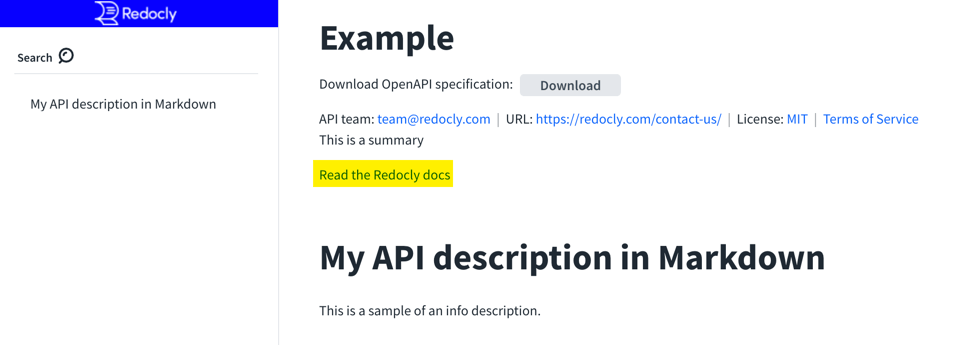
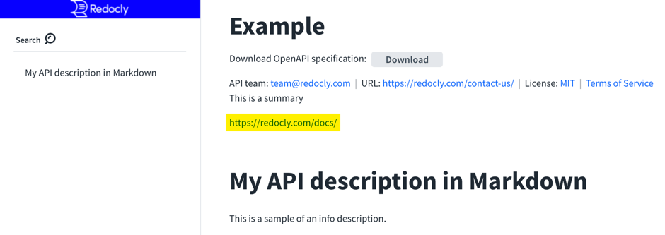

# `externalDocs`

Type: object (map)

|Field name|Type|Description|
|---|:---:|---|
|url|string|**REQUIRED.** The URL for the target documentation.|
|description|string|A description of the target documentation. Used as the link anchor text in Redocly. If not provided, the `url` is used as the link anchor text.|

You may only define one `externalDocs` url.


The external docs link renders before the `info.description` but after the `info.summary`.


## Visuals

The highlights are added for effect in the screenshots to call out the placement of the external docs link.


```yaml
externalDocs:
  url: https://redocly.com/docs/
  description: Read the Redocly docs
```




### Example without `description`

```yaml
externalDocs:
  url: https://redocly.com/docs/
```



## Recommended usage

Don't use `externalDocs` in combination with the `info.description`.
Instead, if there are external docs, include the links from the `info.description`.
This recommendation enables:
- more control of the context
- the possibility to include more than one link.

## Types

- `ExternalDocs`

```js
const ExternalDocs: NodeType = {
  properties: {
    description: { type: 'string' },
    url: { type: 'string' },
  },
  required: ['url'],
};
```
