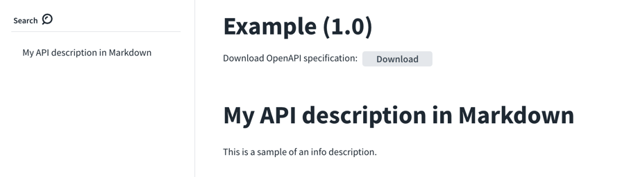
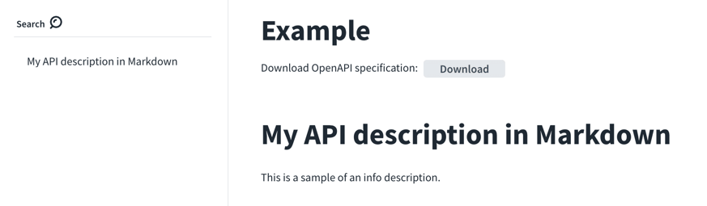
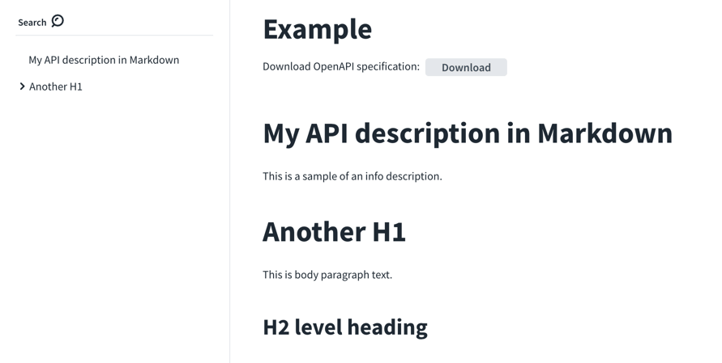
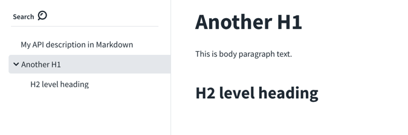
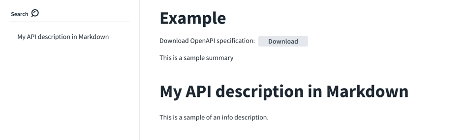
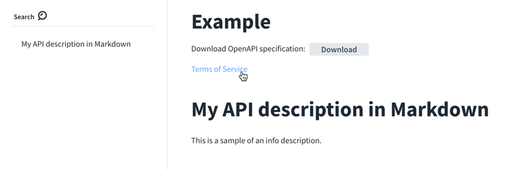
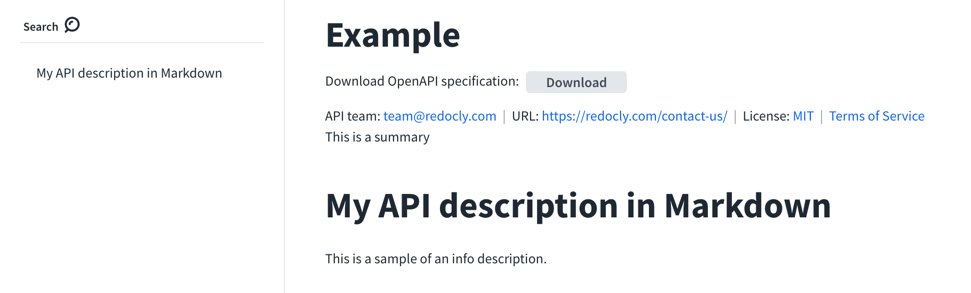

# `info`

**REQUIRED**

Type: object (map)

|Field name|Type|Description|
|---|:---:|---|
|title|string|**REQUIRED.** The title of the API.|
|version|string|**REQUIRED.** The version of the OpenAPI document (which is distinct from the OpenAPI Specification version or the API implementation version).|
|description|string|**RECOMMENDED.** A description of the API (Markdown may be used).|
|summary|string|A short summary of the API.|
|termsOfService|string|A URL to the Terms of Service for the API.|
|contact|[Contact object](./contact.md)|The contact information for the exposed API.|
|license|[License object](./license.md)|The license information for the exposed API.|
|x-logo|[Logo object](https://redoc.ly/docs-legacy/api-reference-docs/specification-extensions/x-logo/)|A commonly used specification extension containing the information about the API logo.|


## Visuals

The following is an example of a minimally recommended OpenAPI `info` object:

```yaml
info:
  title: Example
  version: '1.0'
  description: |
    # My API description in Markdown

    This is a sample of an info description.
```

See how it renders in Redocly OpenAPI documentation.



### `version` Examples

The version is required.
But sometimes an API document doesn't have a sensible version.
To hide it from the documentation, change it to an empty string.

```yaml
info:
  title: Example
  version: ''
  description: |
    # My API description in Markdown

    This is a sample of an info description.
```



### `description` Examples

The H1 and H2 tags from the `description` are pulled into the sidebar navigation.
When an H2 appears after an H1 tag, the preceding H1 tag turns into a group in the sidebar navigation.
The chevron indicates that a group can be expanded.

```yaml
info:
  title: Example
  version: ''
  description: |
    # My API description in Markdown

    This is a sample of an info description.

    # Another H1

    This is body paragraph text.

    ## H2 level heading
```



The following image shows the expansion of the group.



### `summary` Examples

The following example contains a summary.

```yaml
info:
  title: Example
  version: ''
  description: |
    # My API description in Markdown

    This is a sample of an info description.
  summary: This is a sample summary
```

The `summary` renders before the `description`.



### `termsOfService` example

The following example defines a `termsOfService` URL.

```yaml
info:
  title: Example
  version: ''
  description: |
    # My API description in Markdown

    This is a sample of an info description.
  termsOfService: https://redoc.ly/subscription-agreement/
```




### Example with everything

```yaml
info:
  title: Example
  version: ''
  description: |
    # My API description in Markdown

    This is a sample of an info description.
  summary: This is a summary
  termsOfService: https://redoc.ly/subscription-agreement/
  contact:
    name: API team
    email: team@redocly.com
    url: https://redocly.com/contact-us/
  license:
    name: MIT
    url: https://opensource.org/licenses/MIT
```



## Types

- `Info`

```js
const Info: NodeType = {
  properties: {
    title: { type: 'string' },
    version: { type: 'string' },
    description: { type: 'string' },
    termsOfService: { type: 'string' },
    contact: 'Contact',
    license: 'License',
  },
  required: ['title', 'version'],
};
```
