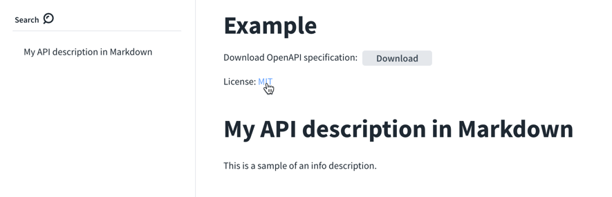

# `license`

| Field Name      |  Type  | Description                                                                                                                                            |
| :-------------- | :----: | :----------------------------------------------------------------------------------------------------------------------------------------------------- |
| name             | string | **REQUIRED.** The license name used for the API. |
| identifier       | string | An [SPDX](https://spdx.dev/spdx-specification-21-web-version/#h.jxpfx0ykyb60) license expression for the API. The identifier field is mutually exclusive of the url field. |
| url             | string | The URL pointing to the contact information. |
| email             | string | The email address of the contact person or organization. |

## Visuals

### `license` example

The following shows a `license` example.

```yaml
info:
  title: Example
  version: ''
  description: |
    # My API description in Markdown

    This is a sample of an info description.
  license:
    name: MIT
    url: https://opensource.org/licenses/MIT
```



## Types

- `License` (found in the [Info object](./info.md))

```js
const License: NodeType = {
  properties: {
    name: { type: 'string' },
    url: { type: 'string' },
  },
  required: ['name'],
};
```
