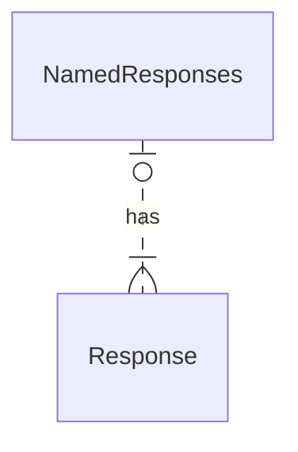

# Named responses

Responses may be reused with [reference objects](./reference.md).

Responses can be defined explicitly for reuse in the components section.

See:
- Used in [Responses Map](./responses.md).
- Composed of [Response Object](./response.md).

## Visual

The named responses are intended for reuse by reference.
See visualizations of responses in the [Response Object](./response.md) and [Responses Map](./responses.md) topics.

## Types

```yaml
components:
  response:
    myStatus:
      # Response Object
```

- `NamedResponses`
- [`Response`](./response.md)


