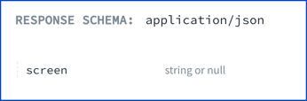

# `null`

> When a schema specifies a type of `null`, it has only one acceptable value: `null`.

OpenAPI 2.0 has no built-in support for `null` types.
Redocly published a [specification extension `x-nullable`](https://redocly.com/docs-legacy/api-reference-docs/specification-extensions/x-nullable/) which can be used to specify that a field value can be `null`.

In OpenAPI 3.0, a built-in `nullable` field was added.

In OpenAPI 3.1, the `type` accepts an array of types, and `null` can be added to the list of types.

## Visuals

The following shows three examples for implementing null in OAS 2.0, 3.0, and 3.1.

```yaml OAS 2.0
type: object
properties:
  screen:
    type: string
    x-nullable: true
```
```yaml OAS 3.0
type: object
properties:
  screen:
    type: string
    nullable: true
```
```yaml OAS 3.1
type: object
properties:
  screen:
    type:
      - string
      - 'null'
```

The following image shows the schema with a string type of property that is also nullable.



## Types

- SchemaProperties

```ts
const SchemaProperties: NodeType = {
  properties: {},
  additionalProperties: 'Schema',
};
```
