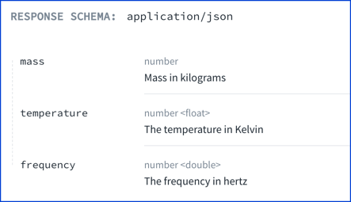

# `number`

> The number type is used for any numeric type, either integers or floating point numbers.

All integers are numbers, but not all numbers are integers.
The number type allows you to provide values with decimals.

## Number data formats

OpenAPI defines additional number formats of `float` and `double`.


A `float` has 7 decimal digits of precision and occupies 32 bits.
A `double` has 15 decimal digits of precision and occupies a total of 64 bits.


## Visuals

The following sample schema describes an object with three number properties:
- `mass`, without any data format specified
- `temperature`, with a `float` data format specified
- `frequency`, with a `double` data format specified

```yaml
type: object
properties:
  mass:
    type: number
    description: Mass in kilograms
  temperature:
    type: number
    description: The temperature in Kelvin
    format: float
  frequency:
    type: number
    description: The frequency in hertz
    format: double
```



## Types

- SchemaProperties

```ts
const SchemaProperties: NodeType = {
  properties: {},
  additionalProperties: 'Schema',
};
```
