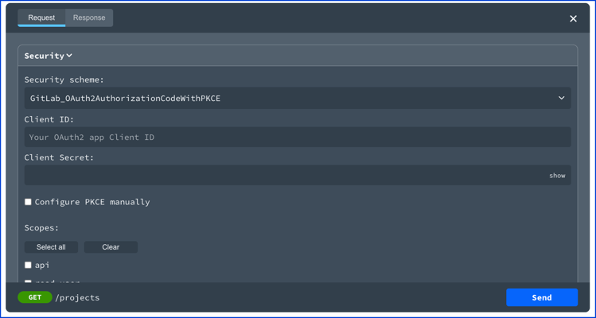
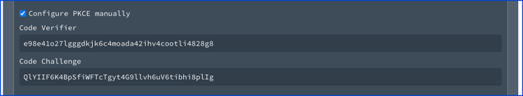
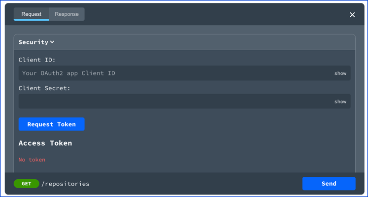
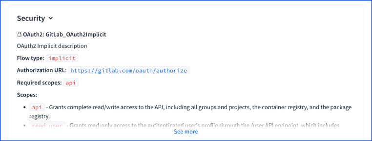
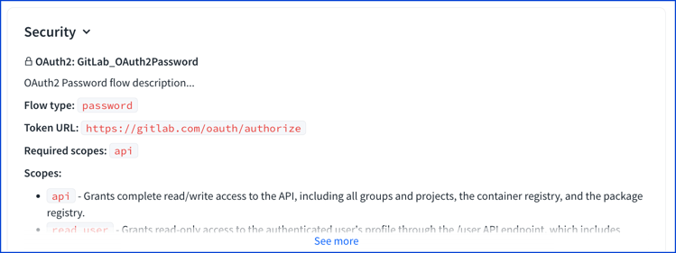
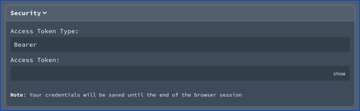

# OAuth Flows

<details>
<summary>
Excerpt from the OpenAPI 3.1 specification about the OAuth Flows object
</summary>

## OAuth Flows Object

Allows configuration of the supported OAuth Flows.

### Fixed Fields

Field Name | Type | Description
---|:---:|---
implicit| [OAuth Flow Object](#oauth-flow-object) | Configuration for the OAuth Implicit flow
password| [OAuth Flow Object](#oauth-flow-object) | Configuration for the OAuth Resource Owner Password flow
clientCredentials| [OAuth Flow Object](#oauth-flow-object) | Configuration for the OAuth Client Credentials flow.  Previously called `application` in OpenAPI 2.0.
authorizationCode| [OAuth Flow Object](#oauth-flow-object) | Configuration for the OAuth Authorization Code flow.  Previously called `accessCode` in OpenAPI 2.0.

This object MAY be extended with [Specification Extensions](./specification-extensions.md).

## OAuth Flow Object

Configuration details for a supported OAuth Flow

### Fixed Fields

Field Name | Type | Applies To | Description
---|:---:|---|---
authorizationUrl | `string` | `oauth2` (`"implicit"`, `"authorizationCode"`) | **REQUIRED**. The authorization URL to be used for this flow. This MUST be in the form of a URL. The OAuth2 standard requires the use of TLS.
tokenUrl | `string` | `oauth2` (`"password"`, `"clientCredentials"`, `"authorizationCode"`) | **REQUIRED**. The token URL to be used for this flow. This MUST be in the form of a URL. The OAuth2 standard requires the use of TLS.
refreshUrl | `string` | `oauth2` | The URL to be used for obtaining refresh tokens. This MUST be in the form of a URL. The OAuth2 standard requires the use of TLS.
scopes | Map[`string`, `string`] | `oauth2` | **REQUIRED**. The available scopes for the OAuth2 security scheme. A map between the scope name and a short description for it. The map MAY be empty.

This object MAY be extended with [Specification Extensions](./specification-extensions.md).

### OAuth Flow Object Examples

```json
{
  "type": "oauth2",
  "flows": {
    "implicit": {
      "authorizationUrl": "https://example.com/api/oauth/dialog",
      "scopes": {
        "write:pets": "modify pets in your account",
        "read:pets": "read your pets"
      }
    },
    "authorizationCode": {
      "authorizationUrl": "https://example.com/api/oauth/dialog",
      "tokenUrl": "https://example.com/api/oauth/token",
      "scopes": {
        "write:pets": "modify pets in your account",
        "read:pets": "read your pets"
      }
    }
  }
}
```

```yaml
type: oauth2
flows:
  implicit:
    authorizationUrl: https://example.com/api/oauth/dialog
    scopes:
      write:pets: modify pets in your account
      read:pets: read your pets
  authorizationCode:
    authorizationUrl: https://example.com/api/oauth/dialog
    tokenUrl: https://example.com/api/oauth/token
    scopes:
      write:pets: modify pets in your account
      read:pets: read your pets
```


</details>


## Visuals

### Authorization Code with PKCE visual

The following describes a security scheme using the Authorization Code flow with PKCE.
PKCE is supported by using the `x-usePkce` specification extension.

```yaml
components:
  securitySchemes:
    GitLab_OAuth2AuthorizationCodeWithPKCE:
      description: OAuth2 Authorization Code with PKCE description
      type: oauth2
      flows:
        authorizationCode:
          x-usePkce:
            disableManualConfiguration: false
            hideClientSecretInput: false
          authorizationUrl: 'https://gitlab.com/oauth/authorize'
          tokenUrl: 'https://gitlab.com/oauth/token'
          scopes:
            'api': Grants complete read/write access to the API, including all groups and projects, the container registry, and the package registry.
            'read_user': Grants read-only access to the authenticated user's profile through the /user API endpoint, which includes username, public email, and full name. Also grants access to read-only API endpoints under /users.
```

The corresponding **Try it** interface displays the client ID and client secret fields.
It is possible to hide the client secret field with the  `hideClientSecretInput` field on the `x-usePkce` object.



If the manual configuration is not disabled, then a user can toggle the "Configure PKCE manually" to edit the code verifier and code challenge.
Use the `disableManualConfiguration` on the `x-usePkce` object to disable manual configuration.



### Client Credentials visual

Client credentials displays a client ID and client secret field in **Try it**.
Once the token is received, it is stored for the duration of the session.


### Implicit flow visual

The implicit flow description.


The implicit flow displays a client ID field in **Try it**.


### Password flow visual

The password flow description.


The password flow displays an access token type field and access token field in **Try it**.
The access token type field is pre-filled with "Bearer" as the value.




## Types

- `OAuth2Flows`
- `AuthorizationCode`
- `ClientCredentials`
- `ImplicitFlow`
- `PasswordFlow`

```js
const OAuth2Flows: NodeType = {
  properties: {
    implicit: 'ImplicitFlow',
    password: 'PasswordFlow',
    clientCredentials: 'ClientCredentials',
    authorizationCode: 'AuthorizationCode',
  },
};
```

### Authorization code flow type

```js
const AuthorizationCode: NodeType = {
  properties: {
    refreshUrl: { type: 'string' },
    authorizationUrl: { type: 'string' },
    scopes: { type: 'object', additionalProperties: { type: 'string' } },
    tokenUrl: { type: 'string' },
  },
  required: ['authorizationUrl', 'tokenUrl', 'scopes'],
};
```

### Client credentials flow type

```js
const ClientCredentials: NodeType = {
  properties: {
    refreshUrl: { type: 'string' },
    scopes: { type: 'object', additionalProperties: { type: 'string' } },
    tokenUrl: { type: 'string' },
  },
  required: ['tokenUrl', 'scopes'],
};
```

### Implicit flow type

```js
const ImplicitFlow: NodeType = {
  properties: {
    refreshUrl: { type: 'string' },
    scopes: { type: 'object', additionalProperties: { type: 'string' } },
    authorizationUrl: { type: 'string' },
  },
  required: ['authorizationUrl', 'scopes']
};
```

### Password flow type

```js
const PasswordFlow: NodeType = {
  properties: {
    refreshUrl: { type: 'string' },
    scopes: { type: 'object', additionalProperties: { type: 'string' } },
    tokenUrl: { type: 'string' },
  },
  required: ['tokenUrl', 'scopes'],
};
```

