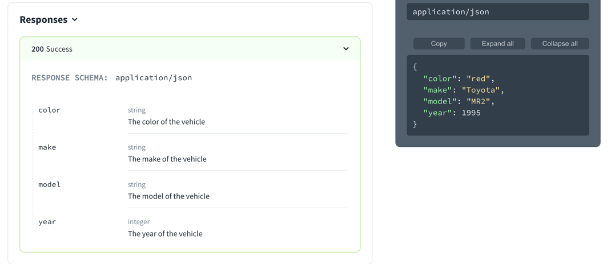

# `object`

> Objects are the mapping type in JSON. They map “keys” to “values”. In JSON, the “keys” must always be strings. Each of these pairs is conventionally referred to as a “property”.

## Visuals
### Flat object

The following schema describes a vehicle as a flat object.
```yaml
type: object
title: Vehicle
properties:
  color:
    type: string
    description: The color of the vehicle
    example: red
  make:
    type: string
    description: The make of the vehicle
    example: Toyota
  model:
    type: string
    description: The model of the vehicle
    example: MR2
  year:
    type: integer
    description: The year of the vehicle
    example: 1995
```

Schemas can be part of parameters, requests, and responses.
The following displays that defined as the response schema.
Pay attention to both the response schema on the left side and the example in the right panel.



### Nested object

The following schema describes a vehicle with a nested object.

```yaml
type: object
title: Vehicle
properties:
  color:
    type: object
    title: Color
    properties:
      exterior:
        type: string
        description: The color of the vehicle exterior
        example: red
      trim:
        type: string
        description: The color of the vehicle trim
        example: chrome
      interior:
        type: string
        description: The color of the vehicle interior
        example: tan
  make:
    type: string
    description: The make of the vehicle
    example: Toyota
  model:
    type: string
    description: The model of the vehicle
    example: MR2
  year:
    type: integer
    description: The year of the vehicle
    example: 1995
```

The following image displays that schema and example object.


Object can have multiple levels of nesting.

## Types

- SchemaProperties

```ts
const SchemaProperties: NodeType = {
  properties: {},
  additionalProperties: 'Schema',
};
```
