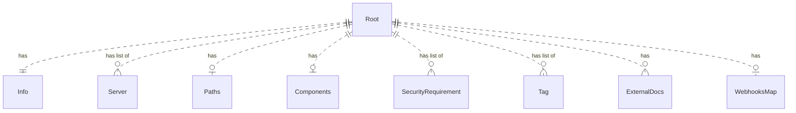
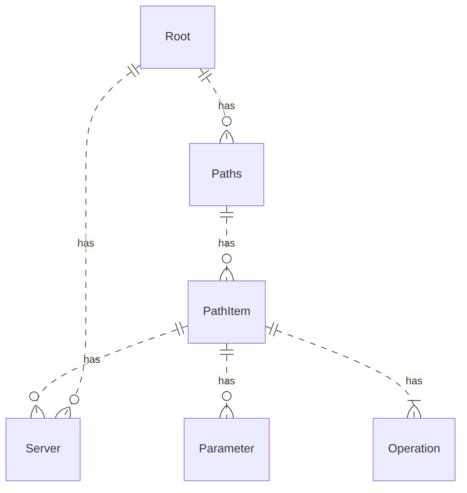
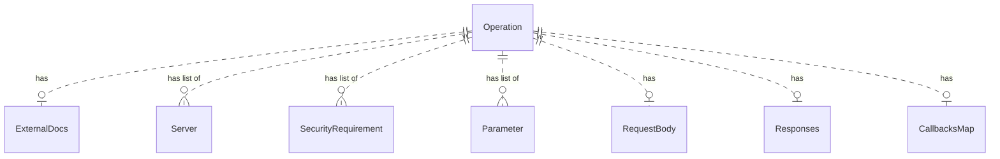
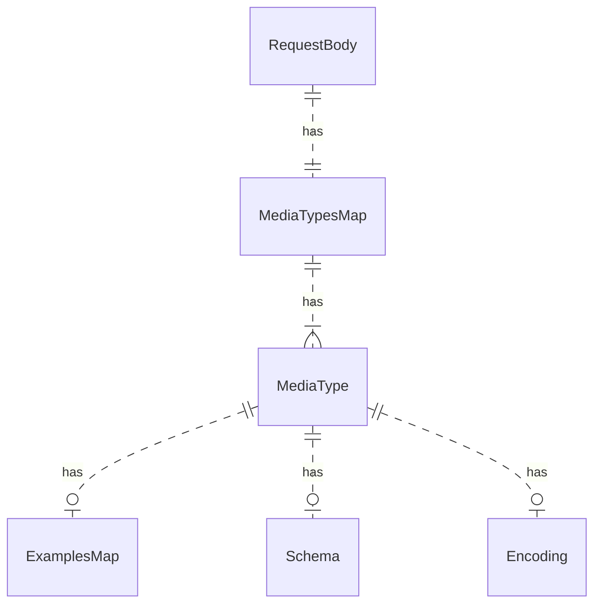
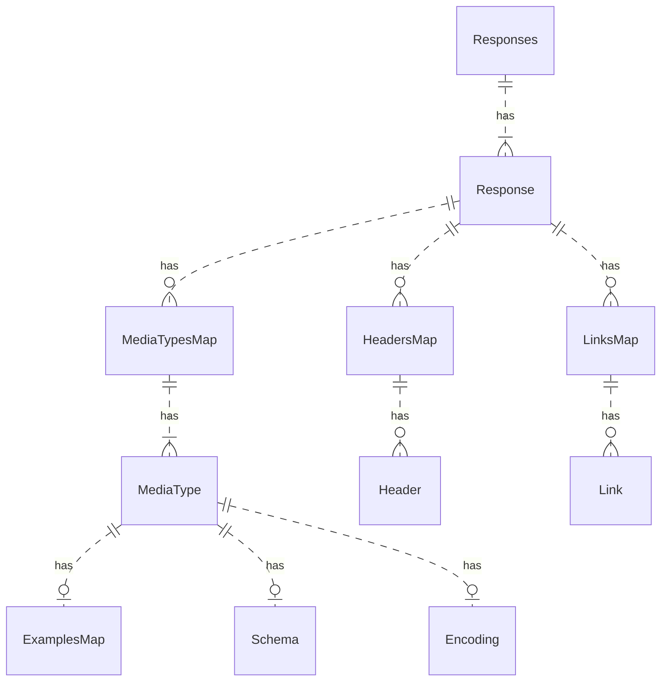
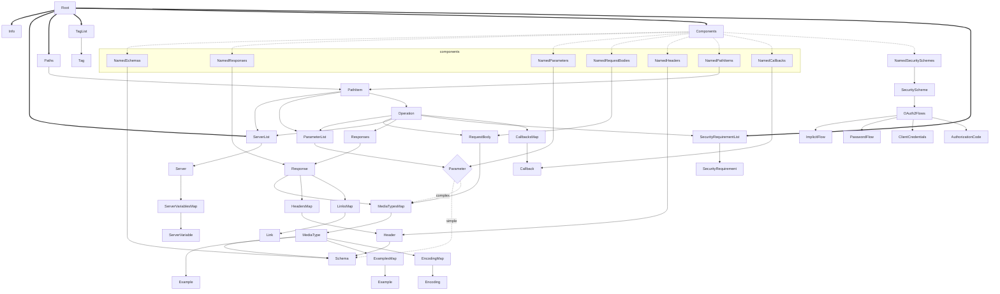

# OpenAPI node types

Redocly CLI uses node types to target custom rules and custom plugins.

The node types naming convention maps to the OpenAPI specification.

This document is for OpenAPI 3.0 and OpenAPI 3.1, which mostly share the same node type tree.

The root of the OpenAPI definition is the `Root` node type.

For technical details on the implementation of types for each OAS version, consult the source files in the Redocly CLI repository:
- OAS 3.1: https://github.com/Redocly/redocly-cli/blob/main/packages/core/src/types/oas3_1.ts
- OAS 3.0: https://github.com/Redocly/redocly-cli/blob/main/packages/core/src/types/oas3.ts
- OAS 2.0: https://github.com/Redocly/redocly-cli/blob/main/packages/core/src/types/oas2.ts

## OpenAPI 3.0 and 3.1 node type tree
- `Root`
  - [openapi](./openapi.md) (not a node type; `openapi` is a property of the `Root`)
  - `Info`
    - `Contact` object
    - `License` object
  - List of `Server` objects  (`ServerList`)
    - `ServerVariables` object
  - `Paths` object
    - `PathItem` object
    - `Operation` object
      - List of `Parameter` objects  (`ParameterList`)
      - `MediaTypesMap` object is a map of media types and corresponding `MediaType` objects
        - `RequestBody` object
        - `Responses` object
          - `Response` object
      - `XCodeSample` list
  - `WebhooksMap` object
    - `PathItem` object
  - `Components` object
    - `NamedSchemas` map of `Schema` objects
      - `SchemaProperties` object
      - `Discriminator` object
        - `DiscriminatorMapping` object
      - `ExternalDocs` object
    - `NamedResponses` map of `Response` objects
    - `NamedParameters` map of `Parameter` objects
    - `NamedExamples` map of `Example` objects
    - `NamedRequestBodies` map of `RequestBody` objects
    - `NamedHeaders` map of `Header` objects
    - `NamedPathItems` map of `PathItem` objects
    - `NamedSecuritySchemes` map of `SecurityScheme` objects
      - `OAuth2Flows` object
        - `ImplicitFlow` object
        - `PasswordFlow` object
        - `AuthenticationCode` object
        - `ClientCredentials` object
    - `NamedLinks` map of `Link` objects
    - `NamedCallbacks` map of `Callback` objects
  - `SecurityRequirement` object
  - List of `Tag` objects (`TagList`)
  - `ExternalDocs` object

## Diagrams

The following diagrams are of the most common types and relations.

### `Root` object

### `Paths` object

### `Operation` object

### `RequestBody` object

### `Responses` object

### Full diagram

## Type discovery

Another method of finding types for any given part of an OpenAPI definition is to use the Redocly VS Code extension.

1. [Install](../../../docs/vscode/installation.md) the Redocly VS Code extension.
1. Open the OpenAPI definition.
1. Place the cursor on the part of the definition you want to find the type for.
1. Open the ["cursor context"](../../../docs/vscode/cursor-context.md) and see the type.
