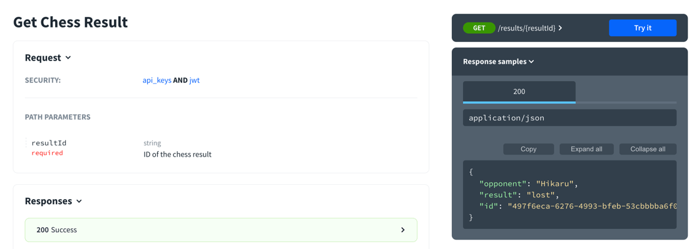
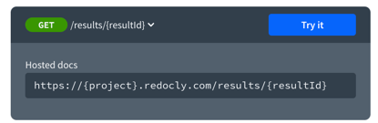
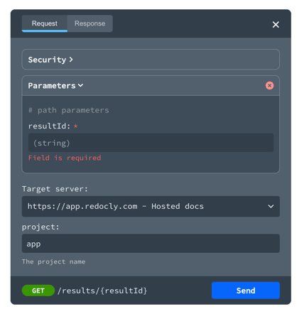
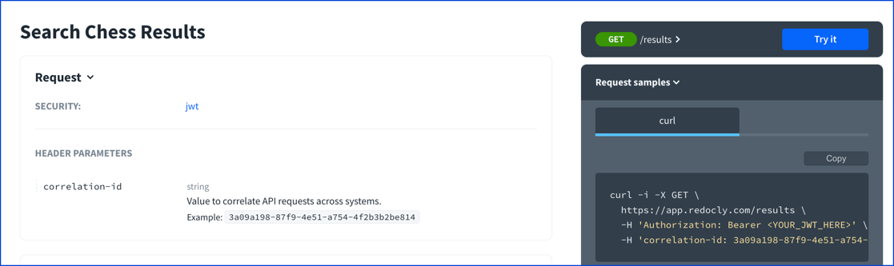

# Parameter Object

Describes a request parameter, which excludes the request body.

A unique parameter is defined by a unique combination of the `name` and `in` values.

<details>
<summary>
Excerpt from the OpenAPI 3.1 specification about the parameter object
</summary>

## Parameter Locations
There are four possible parameter locations specified by the `in` field:
* path - Used together with Path Templating, where the parameter value is actually part of the operation's URL. This does not include the host or base path of the API. For example, in `/items/{itemId}`, the path parameter is `itemId`.
* query - Parameters that are appended to the URL. For example, in `/items?id=###`, the query parameter is `id`.
* header - Custom headers that are expected as part of the request. Note that [RFC7230](https://tools.ietf.org/html/rfc7230#page-22) states header names are case insensitive.
* cookie - Used to pass a specific cookie value to the API.


### Fixed Fields

Field Name | Type | Description
---|:---:|---
name | `string` | **REQUIRED**. The name of the parameter. Parameter names are *case sensitive*. <ul><li>If `in` is `"path"`, the `name` field MUST correspond to a template expression occurring within the [path](./paths.md) field in the [Paths Object](./paths.md). See Path Templating for further information.<li>If `in` is `"header"` and the `name` field is `"Accept"`, `"Content-Type"` or `"Authorization"`, the parameter definition SHALL be ignored.<li>For all other cases, the `name` corresponds to the parameter name used by the `in` property.</ul>
in | `string` | **REQUIRED**. The location of the parameter. Possible values are `"query"`, `"header"`, `"path"` or `"cookie"`.
description | `string` | A brief description of the parameter. This could contain examples of use. [CommonMark syntax](https://spec.commonmark.org/) MAY be used for rich text representation.
required | `boolean` | Determines whether this parameter is mandatory. If the parameter location is `"path"`, this property is **REQUIRED** and its value MUST be `true`. Otherwise, the property MAY be included and its default value is `false`.
deprecated | `boolean` | Specifies that a parameter is deprecated and SHOULD be transitioned out of usage. Default value is `false`.
allowEmptyValue | `boolean` | Sets the ability to pass empty-valued parameters. This is valid only for `query` parameters and allows sending a parameter with an empty value. Default value is `false`. If `style` is used, and if behavior is `n/a` (cannot be serialized), the value of `allowEmptyValue` SHALL be ignored. Use of this property is NOT RECOMMENDED, as it is likely to be removed in a later revision.

The rules for serialization of the parameter are specified in one of two ways.
For simpler scenarios, a `schema` and `style` can describe the structure and syntax of the parameter.

Field Name | Type | Description
---|:---:|---
style | `string` | Describes how the parameter value will be serialized depending on the type of the parameter value. Default values (based on value of `in`): for `query` - `form`; for `path` - `simple`; for `header` - `simple`; for `cookie` - `form`.
explode | `boolean` | When this is true, parameter values of type `array` or `object` generate separate parameters for each value of the array or key-value pair of the map. For other types of parameters this property has no effect. When `style` is `form`, the default value is `true`. For all other styles, the default value is `false`.
allowReserved | `boolean` | Determines whether the parameter value SHOULD allow reserved characters, as defined by [RFC3986](https://tools.ietf.org/html/rfc3986#section-2.2) `:/?#[]@!$&'()*+,;=` to be included without percent-encoding. This property only applies to parameters with an `in` value of `query`. The default value is `false`.
schema | Schema Object | The schema defining the type used for the parameter.
example | Any | Example of the parameter's potential value. The example SHOULD match the specified schema and encoding properties if present. The `example` field is mutually exclusive of the `examples` field. Furthermore, if referencing a `schema` that contains an example, the `example` value SHALL *override* the example provided by the schema. To represent examples of media types that cannot naturally be represented in JSON or YAML, a string value can contain the example with escaping where necessary.
examples | Map[ `string`, [Example Object](./example.md) \| [Reference Object](./reference.md)] | Examples of the parameter's potential value. Each example SHOULD contain a value in the correct format as specified in the parameter encoding. The `examples` field is mutually exclusive of the `example` field. Furthermore, if referencing a `schema` that contains an example, the `examples` value SHALL *override* the example provided by the schema.

For more complex scenarios, the `content` property can define the media type and schema of the parameter.
A parameter MUST contain either a `schema` property, or a `content` property, but not both.
When `example` or `examples` are provided in conjunction with the `schema` object, the example MUST follow the prescribed serialization strategy for the parameter.


Field Name | Type | Description
---|:---:|---
content | Map[`string`, [Media Type Object](./media-type.md)] | A map containing the representations for the parameter. The key is the media type and the value describes it. The map MUST only contain one entry.

### Style Values

In order to support common ways of serializing simple parameters, a set of `style` values are defined.

`style` | `type` |  `in` | Comments
----------- | ------ | -------- | --------
matrix |  `primitive`, `array`, `object` |  `path` | Path-style parameters defined by [RFC6570](https://tools.ietf.org/html/rfc6570#section-3.2.7)
label | `primitive`, `array`, `object` |  `path` | Label style parameters defined by [RFC6570](https://tools.ietf.org/html/rfc6570#section-3.2.5)
form |  `primitive`, `array`, `object` |  `query`, `cookie` | Form style parameters defined by [RFC6570](https://tools.ietf.org/html/rfc6570#section-3.2.8). This option replaces `collectionFormat` with a `csv` (when `explode` is false) or `multi` (when `explode` is true) value from OpenAPI 2.0.
simple | `array` | `path`, `header` | Simple style parameters defined by [RFC6570](https://tools.ietf.org/html/rfc6570#section-3.2.2).  This option replaces `collectionFormat` with a `csv` value from OpenAPI 2.0.
spaceDelimited | `array`, `object` | `query` | Space separated array or object values. This option replaces `collectionFormat` equal to `ssv` from OpenAPI 2.0.
pipeDelimited | `array`, `object` | `query` | Pipe separated array or object values. This option replaces `collectionFormat` equal to `pipes` from OpenAPI 2.0.
deepObject | `object` | `query` | Provides a simple way of rendering nested objects using form parameters.

</details>

## Visuals

### Path parameter

> * path - Used together with Path Templating, where the parameter value is actually part of the operation's URL. This does not include the host or base path of the API. For example, in `/items/{itemId}`, the path parameter is `itemId`.

The following excerpt from an OpenAPI definition demonstrates a path parameter.
The `resultId` is used as a path template `{resultId}` in the curly braces.
Then, the parameter is defined in the parameters object of the corresponding path item or operation.

```yaml
paths:
  /results/{resultId}:
    get:
      summary: Get Chess Result
      operationId: getChessResult
      parameters:
        - name: resultId
          in: path
          required: true
          schema:
            type: string
          description: ID of the chess result
      responses:
        '200':
          description: Success
          content:
            application/json:
              schema:
                $ref: "#/components/schemas/ChessResult"
```

Redocly renders the parameter in the request description.



The endpoint shows the path template variable.



The try it console shows the field is required.
The very bottom shows the path the request will be made to.
The very bottom displays the path template variable until a value is provided.



The very bottom shows the path the request will be made once a value is supplied.


### Query parameter

Query parameters are defined with the location `in: query`.

The following example defines three query parameters.

```yaml
paths:
  /results:
    get:
      summary: Search Chess Results
      operationId: searchChessResult
      parameters:
        - name: username
          in: query
          schema:
            type: string
            example: hikaru
          description: Value to query the chess results against usernames
        - name: result
          in: query
          schema:
            type: string
            enum:
              - won
              - lost
              - draw
            example: won
          description: The result of the chess match
        - name: limit
          in: query
          schema:
            type: integer
            default: 10
            maximum: 100
          description: Limits the number of results returned
```

Notice how Redocly renders the default values, example values in the descriptions.


The values are also used in the generated code samples.

```bash
curl -i -X GET \
  'https://app.redocly.com/results?username=hikaru&result=won&limit=10' \
  -H 'Authorization: Bearer <YOUR_JWT_HERE>' \
  -H 'secret-key: YOUR_API_KEY_HERE'
```

The example and default values are also used to pre-fill the try it fields.
The `result` field has an `enum` in the schema, and the try it uses a select menu for that field.


### Header parameters


The header parameters are for request parameters.
To document response headers see the [Header Object](./header.md)

There are some restricted headers including:
- `Authorization` (use [security](./security.md) instead)
- `Accept` and `Content-Type` (use [media-types](./media-type.md) instead)


> * header - Custom headers that are expected as part of the request. Note that [RFC7230](https://tools.ietf.org/html/rfc7230#page-22) states header names are case insensitive.

The following excerpt describes a header parameter.

```yaml
paths:
  /results:
    get:
      summary: Search Chess Results
      operationId: searchChessResult
      parameters:
        - name: correlation-id
          in: header
          schema:
            type: string
            example: 3a09a198-87f9-4e51-a754-4f2b3b2be814
          description: Value to correlate API requests across systems.
```
Redocly renders the header parameters in the following screenshot.



### Cookie parameters

> * cookie - Used to pass a specific cookie value to the API.

The following OpenAPI excerpt shows an operation that accepts a `session-id` cookie parameter in the request.

```yaml
paths:
  /results:
    get:
      summary: Search Chess Results
      operationId: searchChessResult
      parameters:
        - name: session-id
          in: cookie
          schema:
            type: string
            example: 3a09a198-87f9-4e51-a754-4f2b3b2be814
          description: Session ID.
```

The screenshot shows how Redocly renders the cookie description.


## Types

- `NamedParameters` (map of string names to `Parameter` objects in `Components` object)
- `ParameterList` (in `Operation` object)
- `Parameter`

```js
const Parameter: NodeType = {
  properties: {
    name: { type: 'string' },
    in: { enum: ['query', 'header', 'path', 'cookie'] },
    description: { type: 'string' },
    required: { type: 'boolean' },
    deprecated: { type: 'boolean' },
    allowEmptyValue: { type: 'boolean' },
    style: {
      enum: ['form', 'simple', 'label', 'matrix', 'spaceDelimited', 'pipeDelimited', 'deepObject'],
    },
    explode: { type: 'boolean' },
    allowReserved: { type: 'boolean' },
    schema: 'Schema',
    example: { isExample: true },
    examples: mapOf('Example'),
    content: 'MediaTypeMap',
  },
  required: ['name', 'in'],
};
```
