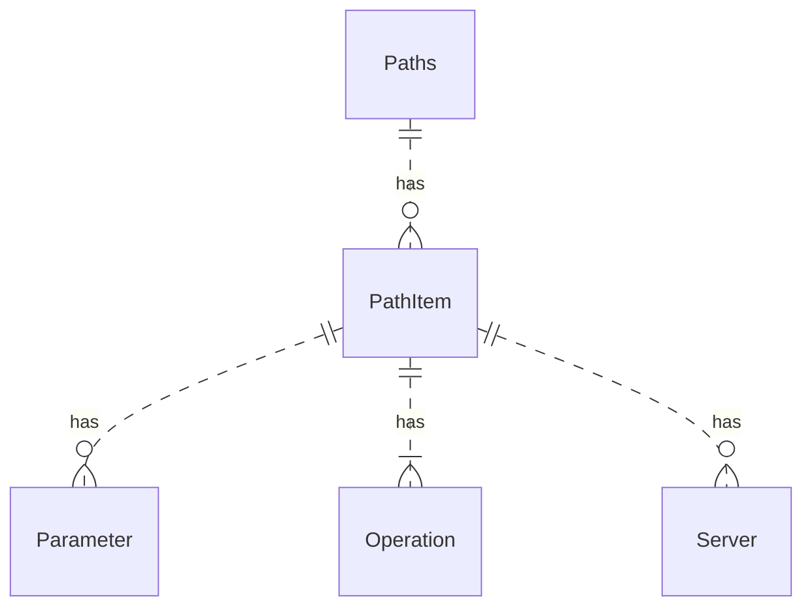

# Path Item Object


<details>
<summary>
Excerpt from the OpenAPI 3.1 specification about the Path Item object
</summary>

## Path Item Object

Describes the operations available on a single path.
A Path Item MAY be empty, due to ACL constraints.
The path itself is still exposed to the documentation viewer but they will not know which operations and parameters are available.

### Fixed Fields

Field Name | Type | Description
---|:---:|---
`$ref` | `string` | Allows for a referenced definition of this path item. The referenced structure MUST be in the form of a [Path Item Object](./path-item.md).  In case a Path Item Object field appears both in the defined object and the referenced object, the behavior is undefined. See the rules for resolving [Relative References](./reference.md).
summary| `string` | An optional, string summary, intended to apply to all operations in this path.
description | `string` | An optional, string description, intended to apply to all operations in this path. [CommonMark syntax](https://spec.commonmark.org/) MAY be used for rich text representation.
get | [Operation Object](./operation.md) | A definition of a GET operation on this path.
put | [Operation Object](./operation.md) | A definition of a PUT operation on this path.
post | [Operation Object](./operation.md) | A definition of a POST operation on this path.
delete | [Operation Object](./operation.md) | A definition of a DELETE operation on this path.
options | [Operation Object](./operation.md) | A definition of a OPTIONS operation on this path.
head | [Operation Object](./operation.md) | A definition of a HEAD operation on this path.
patch | [Operation Object](./operation.md) | A definition of a PATCH operation on this path.
trace | [Operation Object](./operation.md) | A definition of a TRACE operation on this path.
servers | [[Server Object](./servers.md)] | An alternative `server` array to service all operations in this path.
parameters | [[Parameter Object](./parameters.md) \| [Reference Object](./reference.md)] | A list of parameters that are applicable for all the operations described under this path. These parameters can be overridden at the operation level, but cannot be removed there. The list MUST NOT include duplicated parameters. A unique parameter is defined by a combination of a [name](./parameter.md) and [location](./parameter.md). The list can use the [Reference Object](./reference.md) to link to parameters that are defined at the [OpenAPI Object's components/parameters](./parameters.md).


This object MAY be extended with [Specification Extensions](./specification-extensions.md).

### Path Item Object Example

```json
{
  "get": {
    "description": "Returns pets based on ID",
    "summary": "Find pets by ID",
    "operationId": "getPetsById",
    "responses": {
      "200": {
        "description": "pet response",
        "content": {
          "*/*": {
            "schema": {
              "type": "array",
              "items": {
                "$ref": "#/components/schemas/Pet"
              }
            }
          }
        }
      },
      "default": {
        "description": "error payload",
        "content": {
          "text/html": {
            "schema": {
              "$ref": "#/components/schemas/ErrorModel"
            }
          }
        }
      }
    }
  },
  "parameters": [
    {
      "name": "id",
      "in": "path",
      "description": "ID of pet to use",
      "required": true,
      "schema": {
        "type": "array",
        "items": {
          "type": "string"
        }
      },
      "style": "simple"
    }
  ]
}
```

```yaml
get:
  description: Returns pets based on ID
  summary: Find pets by ID
  operationId: getPetsById
  responses:
    '200':
      description: pet response
      content:
        '*/*' :
          schema:
            type: array
            items:
              $ref: '#/components/schemas/Pet'
    default:
      description: error payload
      content:
        'text/html':
          schema:
            $ref: '#/components/schemas/ErrorModel'
parameters:
- name: id
  in: path
  description: ID of pet to use
  required: true
  schema:
    type: array
    items:
      type: string
  style: simple
```

</details>


## Visuals

Redocly renders each operation.
The HTTP method renders as a badge in the sidebar navigation as well as next to the operation summary.

Redocly renders the path within each path item's corresponding operations.


## Types

- `PathItem`

```js
const PathItem: NodeType = {
  properties: {
    $ref: { type: 'string' },
    servers: listOf('Server'),
    parameters: listOf('Parameter'),
    summary: { type: 'string' },
    description: { type: 'string' },
    get: 'Operation',
    put: 'Operation',
    post: 'Operation',
    delete: 'Operation',
    options: 'Operation',
    head: 'Operation',
    patch: 'Operation',
    trace: 'Operation',
  },
};
```

The `PathItem` type has a close relationship to the [`Operation` type](./operation.md).


