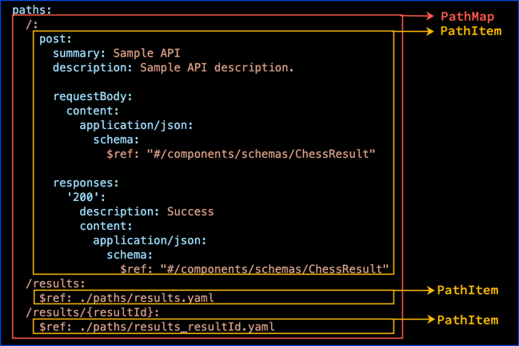

# Paths Object

The Paths Object is a map of a paths to the path item object.
A path starts with a `/`.

> Path templating refers to the usage of template expressions, delimited by curly braces ({}), to mark a section of a URL path as replaceable using path parameters.

These are examples of valid paths:

- `/`
- `/customers`
- `/customers/{customerId}`


<details>
<summary>
Excerpt from the OpenAPI 3.1 specification about the Paths object
</summary>

## Paths Object

Holds the relative paths to the individual endpoints and their operations.
The path is appended to the URL from the [`Server Object`](./servers.md) in order to construct the full URL.  The Paths MAY be empty, due to Access Control List (ACL) constraints.

### Patterned Fields

Field Pattern | Type | Description
---|:---:|---
`/{path}` | [Path Item Object](./path-item.md) | A relative path to an individual endpoint. The field name MUST begin with a forward slash (`/`). The path is **appended** (no relative URL resolution) to the expanded URL from the [`Server Object`](./servers.md)'s `url` field in order to construct the full URL. [Path templating](#path-templating) is allowed. When matching URLs, concrete (non-templated) paths would be matched before their templated counterparts. Templated paths with the same hierarchy but different templated names MUST NOT exist as they are identical. In case of ambiguous matching, it's up to the tooling to decide which one to use.

This object MAY be extended with [Specification Extensions](./specification-extensions.md).

### Path Templating Matching

Assuming the following paths, the concrete definition, `/pets/mine`, will be matched first if used:

```text
  /pets/{petId}
  /pets/mine
```

The following paths are considered identical and invalid:

```text
  /pets/{petId}
  /pets/{name}
```

The following may lead to ambiguous resolution:

```text
  /{entity}/me
  /books/{id}
```

### Paths Object Example

```json
{
  "/pets": {
    "get": {
      "description": "Returns all pets from the system that the user has access to",
      "responses": {
        "200": {
          "description": "A list of pets.",
          "content": {
            "application/json": {
              "schema": {
                "type": "array",
                "items": {
                  "$ref": "#/components/schemas/pet"
                }
              }
            }
          }
        }
      }
    }
  }
}
```

```yaml
/pets:
  get:
    description: Returns all pets from the system that the user has access to
    responses:
      '200':
        description: A list of pets.
        content:
          application/json:
            schema:
              type: array
              items:
                $ref: '#/components/schemas/pet'
```

### Path templating

Path templating refers to the usage of template expressions, delimited by curly braces ({}), to mark a section of a URL path as replaceable using path parameters.

Each template expression in the path MUST correspond to a path parameter that is included in the Path Item itself and/or in each of the Path Item's Operations. An exception is if the path item is empty, for example due to ACL constraints, matching path parameters are not required.

The value for these path parameters MUST NOT contain any unescaped "generic syntax" characters described by RFC3986: forward slashes (/), question marks (?), or hashes (#).

</details>

## Visuals

The following excerpt of an OpenAPI definition shows paths declared:

```yaml
openapi: 3.0.3
# ...
paths:
  /:
    post:
      summary: Sample API
      description: Sample API description.

      requestBody:
        content:
          application/json:
            schema:
              $ref: "#/components/schemas/ChessResult"

      responses:
        '200':
          description: Success
          content:
            application/json:
              schema:
                $ref: "#/components/schemas/ChessResult"
  /results:
    $ref: ./paths/results.yaml
  /results/{resultId}:
    $ref: ./paths/results_resultId.yaml
```

Redocly renders the path within each path item's corresponding operations.


See [Parameters](./parameters.md) to learn more about parameters.

## Types

The paths object is called the `Paths` type in Redocly.
The `Paths` can have zero to many paths, each with a value of a `PathItem` object.


