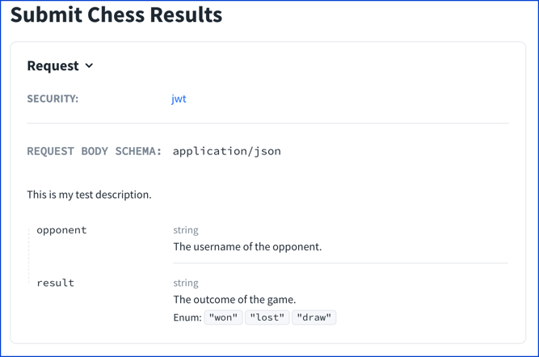
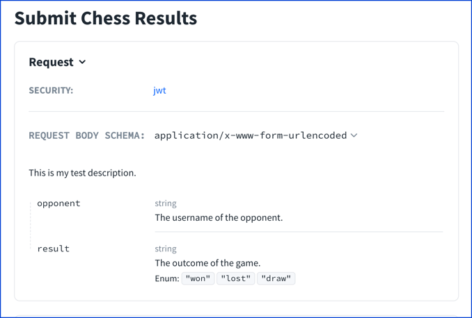
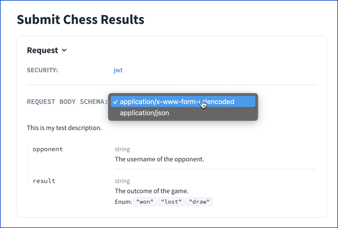

# Request Body Object


<details>
<summary>
Excerpt from the OpenAPI 3.1 specification about the request body object
</summary>

> ## Request Body Object
>
> Describes a single request body.
>
> ### Fixed Fields
>
> Field Name | Type | Description
> ---|:---:|---
> description | `string` | A brief description of the request body. This could contain examples of use.  [CommonMark syntax](https://spec.commonmark.org/) MAY be used for rich text representation.
> content | Map[`string`, [Media Type Object](./media-type.md)] | **REQUIRED**. The content of the request body. The key is a media type or [media type range](https://tools.ietf.org/html/rfc7231#appendix-D) and the value describes it.  For requests that match multiple keys, only the most specific key is applicable. e.g. text/plain overrides text/*
> required | `boolean` | Determines if the request body is required in the request. Defaults to `false`.
>
>
> This object MAY be extended with [Specification Extensions](./specification-extensions.md).

</details>

The request body is defined inside of operations (including paths and webhooks).
The request body can also be defined inside of the named `requestBodies` object in components.

## Visuals

### Single media type

The following example shows a request body.

```yaml
paths:
  /results:
    post:
      summary: Submit Chess Results
      operationId: postChessResult
      requestBody:
        required: true
        description: This is my test description.
        content:
          application/json:
            schema:
              $ref: "#/components/schemas/ChessResult"
```

The following screenshot renders the request body.



### Multiple media types

Multiple media types may be defined for any operation.

```yaml
paths:
  /results:
    post:
      summary: Submit Chess Results
      operationId: postChessResult
      requestBody:
        required: true
        description: This is my test description.
        content:
          application/x-www-form-urlencoded:
            schema:
              $ref: "#/components/schemas/ChessResult"
          application/json:
            schema:
              $ref: "#/components/schemas/ChessResult"
```

Redocly renders a UI select element to indicate there are multiple media types.
They will be rendered in the order they are defined.



When the UI element is selected, the user sees the available options.



## Types

- NamedRequestBodies
- RequestBody

```ts
const RequestBody: NodeType = {
  properties: {
    description: { type: 'string' },
    required: { type: 'boolean' },
    content: 'MediaTypeMap',
  },
  required: ['content'],
};
```
