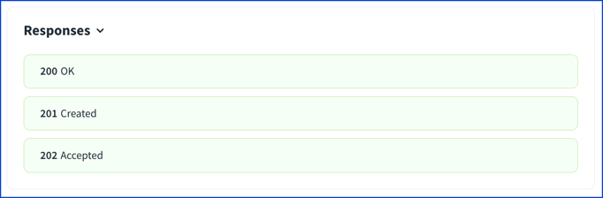
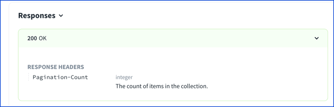
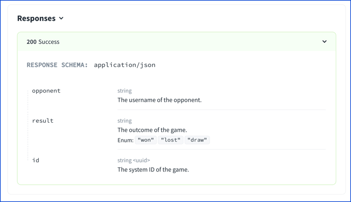

# Response Object

The response object describes a single response in the [Responses Map](./responses.md).

It can be described in a separate file or in the `components.responses` section and reused as a reference object.

<details>
<summary>
Excerpt from the OpenAPI 3.1 specification about the response object
</summary>

> Describes a single response from an API Operation, including design-time, static
`links` to operations based on the response.
>
> ## Fixed Fields
>
> Field Name | Type | Description
> ---|:---:|---
> description | `string` | **REQUIRED**. A description of the response. [CommonMark syntax](https://spec.commonmark.org/) MAY be used for rich text representation.
> headers | Map[`string`, [Header Object](./header.md)  \| [Reference Object](./reference.md)] |  Maps a header name to its definition. [RFC7230](https://tools.ietf.org/html/rfc7230#page-22) states header names are case insensitive. If a response header is defined with the name `"Content-Type"`, it SHALL be ignored.
> content | Map[`string`, [Media Type Object](./media-type.md)] | A map containing descriptions of potential response payloads. The key is a media type or [media type range](https://tools.ietf.org/html/rfc7231#appendix-D) and the value describes it.  For responses that match multiple keys, only the most specific key is applicable. e.g. text/plain overrides text/*
> links | Map[`string`, [Link Object](./links.md) \| [Reference Object](./reference.md)] | A map of operations links that can be followed from the response. The key of the map is a short name for the link, following the naming constraints of the names for [Component Objects](./components.md).
>
> This object MAY be extended with Specification Extensions.

</details>

A response object is connected to the Responses Map which will have possible keys of:
- default, or
- HTTP codes (such as '200', '201', '400', and so on)
- HTTP ranges ('1XX', '2XX', '3XX', '4XX', or '5XX')

The examples use '200' as the responses map key.

(_Why? Because everything's going to be OK._)

## Visuals
### `description`

**REQUIRED.** A description of the response.

```yaml
responses:
  '200':
    description: OK
  '201':
    description: Created
  '202':
    description: Accepted
```



### `headers`

The named headers are specific to responses.
These are different from request headers which are types of parameters in OpenAPI.
The main differences are:

1. `name` MUST NOT be specified, it is given in the corresponding headers map.
1. `in` MUST NOT be specified, it is implicitly in header.
1. All traits that are affected by the location MUST be applicable to a location of header (for example, `style`).

Also, a common oversight is that the `Content-Type` header name is ignored.

The headers map is a map of header names as the map keys, and header objects as the values.

```yaml
responses:
  '200':
    description: OK
    headers:
      Pagination-Count:
        description: The count of items in the collection.
        schema:
          type: integer
```



Learn more about the [Header Object](./header.md).
### `content`

> A map containing descriptions of potential response payloads. The key is a media type or [media type range](https://tools.ietf.org/html/rfc7231#appendix-D) and the value describes it.  For responses that match multiple keys, only the most specific key is applicable. e.g. text/plain overrides text/*.

The "Accept" header field can be used by user agents to specify response media types that are acceptable.

Common media types:

- application/json
- application/xml
- image/png
- image/*
- application/pdf
- text/plain
- text/html
- text/csv
- application/octet-stream

See a list of all [registered media types](https://www.iana.org/assignments/media-types/media-types.xhtml).

The value in the content map is a [Media Type Object](./media-type.md).

```yaml
responses:
  200:
    description: Success
    content:
      application/json:
        schema:
          $ref: "#/components/schemas/ChessResult"
```



### `links`

Links are rarely used.

Redocly doesn't visualize the links.
If you have an idea for how to visualize the links, please let us know in a [GitHub issue comment](https://github.com/Redocly/redoc/issues/572).

## Types

- Response
- MediaTypesMap

```ts
const Response: NodeType = {
  properties: {
    description: { type: 'string' },
    headers: mapOf('Header'),
    content: 'MediaTypesMap',
    links: mapOf('Link'),
  },
  required: ['description'],
};
```
