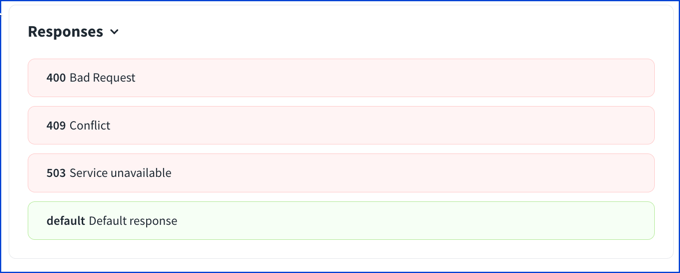
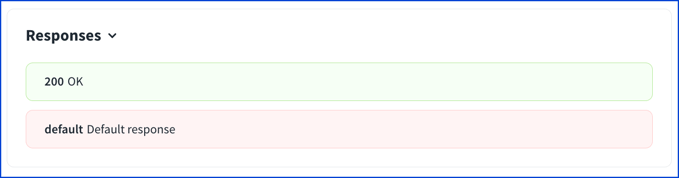
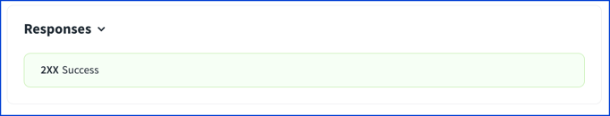
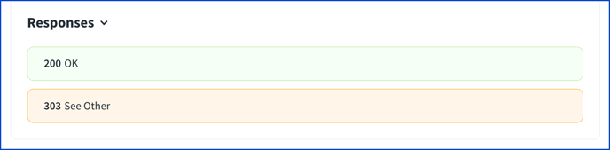
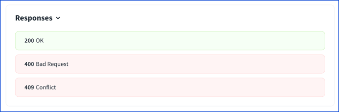
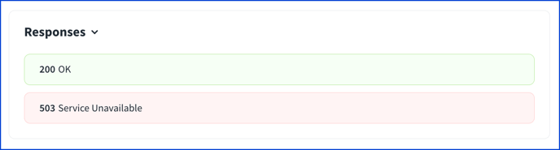
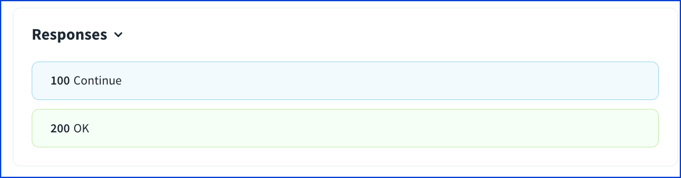

# Responses Map

The Responses Map describes the possible responses to an HTTP request.
It is declared in the Operation Object.
The documentation is expected to cover at least one successful case.

```yaml
responses:
  '200':
    # Response Object | Reference Object
```

<details>
<summary>
Excerpt from the OpenAPI 3.1 specification about responses
</summary>

> A container for the expected responses of an operation. The container maps a HTTP response code to the expected response.
>
> The documentation is not necessarily expected to cover all possible HTTP response codes because they may not be known in advance. However, documentation is expected to cover a successful operation response and any known errors.
>
> The `default` MAY be used as a default response object for all HTTP codes that are not covered individually by the `Responses Object`.
>
> The `Responses Object` MUST contain at least one response code, and if only one response code is provided it SHOULD be the response for a successful operation call.
>
> This object MAY be extended with Specification Extensions.
>
> ## Fixed Fields
>
> Field Name | Type | Description
> ---|:---:|---
> default | [Response Object](./response.md) \| [Reference Object](./reference.md) | The documentation of responses other than the ones declared for specific HTTP response codes. Use this field to cover undeclared responses.
>
> ## Patterned Fields
>
> Field Pattern | Type | Description
> ---|:---:|---
> HTTP Status Code | [Response Object](./response.md) \| [Reference Object](./reference.md) | Any HTTP status code can be used as the property name, but only one property per code, to describe the expected response for that HTTP status code. This field MUST be enclosed in quotation marks (for example, "200") for compatibility between JSON and YAML. To define a range of response codes, this field MAY contain the uppercase wildcard character `X`. For example, `2XX` represents all response codes between `[200-299]`. Only the following range definitions are allowed: `1XX`, `2XX`, `3XX`, `4XX`, and `5XX`. If a response is defined using an explicit code, the explicit code definition takes precedence over the range definition for that code.

</details>

## Visuals

The following examples use a minimal [Response Object](./response.md) with a `description`.
The [Response Object](./response.md) topic covers the response object in depth.

### default

The `default` can be used to cover undeclared responses.
The `default` response is not required and used less frequently.

If there are no successful responses declared in the responses map, then the `default` is highlighted as successful in green.

```yaml
responses:
  default:
    description: Default response
  '400':
    description: Bad Request
  '409':
    description: Conflict
  '503':
    description: Service unavailable
```



If there is at least one successful response declared, then the `default` is highlighted similarly to an error in red.

```yaml
responses:
  '200':
    description: OK
  default:
    description: Default response
```




### Successful response

The responses MUST contain one successful response.
As mentioned above, if there is a `default` and no other successful responses, then it is assumed to be the successful response.

Otherwise, the successful responses are in the 200-series from 200 to 299.
The common responses are:

| Successful code | Description |
|:---:|---|
| 200 | OK |
| 201 | Created |
| 202 | Accepted |
| 204 | No Content |

It is also possible to use `2XX` to indicate any successful response.

```yaml
responses:
  '200':
    description: OK
  '201':
    description: Created
  '202':
    description: Accepted
```


```yaml
responses:
  2XX:
    description: Success
```




### Redirects

Redirects are in the 300-series (300-399).
`3XX` is used to indicate any redirect response.

The common responses are:

| Redirect code | Description |
|:---:|---|
| 301 | Moved Permanently |
| 302 | Found |
| 303 | See Other |

```yaml
responses:
  '200':
    description: OK
  '303':
    description: See Other
```




### Client errors

Client errors are in the 400-series (400-499).
It is possible to use `4XX` to indicate any client error.

The common client errors are:

| Error code | Description |
|:---:|---|
| 400 | Moved Permanently |
| 401 | Unauthorized |
| 403 | Forbidden |
| 404 | Not Found |
| 409 | Conflict |
| 422 | Unprocessable Content |
| 429 | Too Many Requests |


```yaml
responses:
  '200':
    description: OK
  '400':
    description: Bad Request
  '409':
    description: Conflict
```



### Server errors

Server errors are in the 500-series (500-599).
They can be represented with `5XX` to indicate any server error.

Server errors are usually not described in API definitions.

The common server errors are:

| Error code | Description |
|:---:|---|
| 500 | Internal Server Error |
| 502 | Bad Gateway |
| 503 | Service Unavailable |
| 504 | Gateway Timeout |

```yaml
responses:
  '200':
    description: OK
  '503':
    description: Service Unavailable
```



### Informational response

While rarely defined in APIs, it is possible to describe informational responses which are in the 100-series (100-199).
Use `1XX` to describe the entire range of informational responses.

The common informational responses are:

| Informational code | Description |
|:---:|---|
| 100 | Continue |
| 101 | Switching Protocols |

```yaml
responses:
  '100':
    description: Continue
  '200':
    description: OK
```



## Types

- NamedResponses
- Responses
- Response

```ts
const Responses: NodeType = {
  properties: { default: 'Response' },
  additionalProperties: (_v: any, key: string) =>
    responseCodeRegexp.test(key) ? 'Response' : undefined,
};

const Response: NodeType = {
  properties: {
    description: { type: 'string' },
    headers: mapOf('Header'),
    content: 'MediaTypesMap',
    links: mapOf('Link'),
  },
  required: ['description'],
};
```
