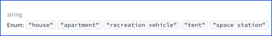
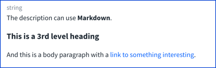
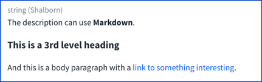
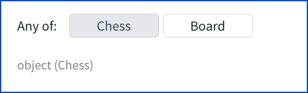
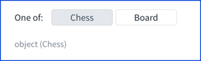
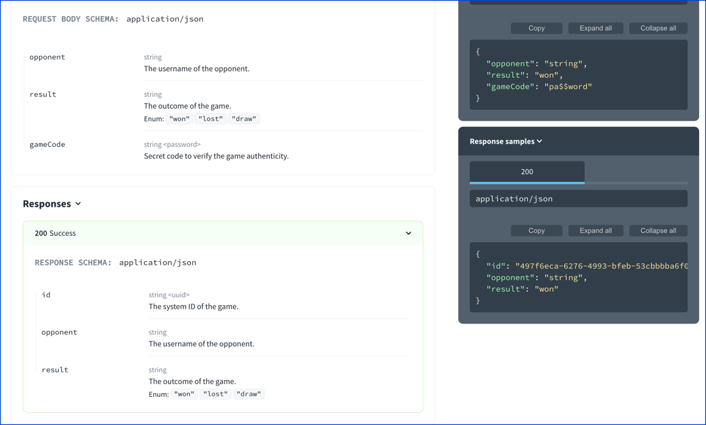
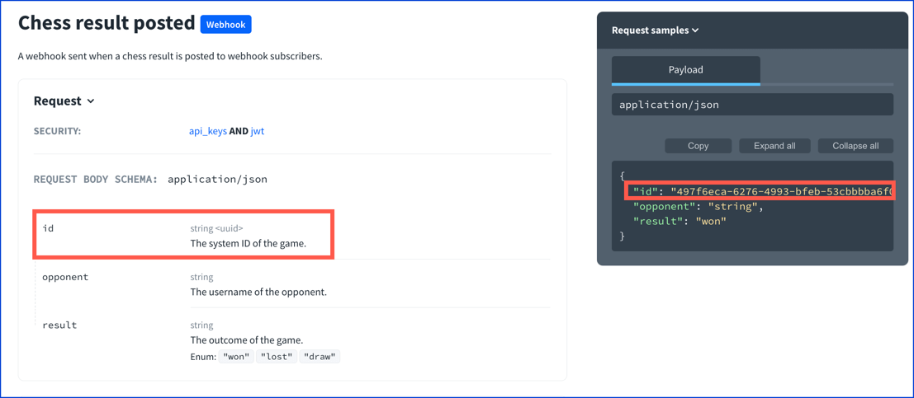
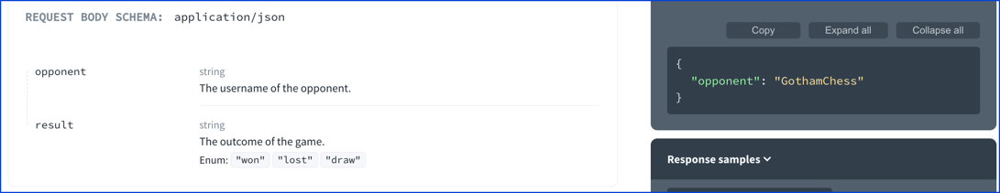
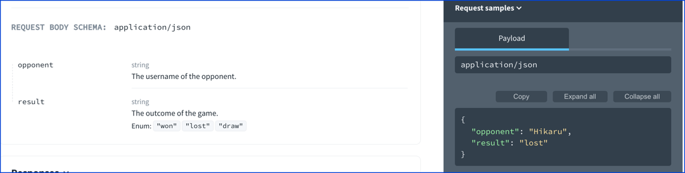

# `schemas`

OpenAPI 3.0 and 3.1 diverge in schemas.
OpenAPI 3.1 uses a newer draft of [JSON Schema](https://datatracker.ietf.org/doc/html/draft-bhutton-json-schema-00) with less modifications.

## Common properties

- type
- title
- description
- example (examples in OpenAPI 3.1)
- enum
- format
- properties
- items
- required

Nesting adds complexity to definitions.
Polymorphism adds more complexity.

<details>
<summary>
Excerpt from the OpenAPI 3.0 specification about schemas
</summary>

> The Schema Object allows the definition of input and output data types.
> These types can be objects, but also primitives and arrays.
> This object is an extended subset of the [JSON Schema Specification Wright Draft 00](https://json-schema.org/).
>
> For more information about the properties, see [JSON Schema Core](https://tools.ietf.org/html/draft-wright-json-schema-00) and [JSON Schema Validation](https://tools.ietf.org/html/draft-wright-json-schema-validation-00).
> Unless stated otherwise, the property definitions follow the JSON Schema.
>
> ### Properties
>
> The following properties are taken directly from the JSON Schema definition and follow the same specifications:
>
> - title
> - multipleOf
> - maximum
> - exclusiveMaximum
> - minimum
> - exclusiveMinimum
> - maxLength
> - minLength
> - pattern (This string SHOULD be a valid regular expression, according to the [Ecma-262 Edition 5.1 regular expression](https://www.ecma-international.org/ecma-262/5.1/#sec-15.10.1) dialect)
> - maxItems
> - minItems
> - uniqueItems
> - maxProperties
> - minProperties
> - required
> - enum
>
> The following properties are taken from the JSON > Schema definition but their definitions were adjusted to the OpenAPI Specification.
> - type - Value MUST be a string. Multiple types via an array are not supported.
> - allOf - Inline or referenced schema MUST be of a Schema Object and not a standard JSON Schema.
> - oneOf - Inline or referenced schema MUST be of a Schema Object and not a standard JSON Schema.
> - anyOf - Inline or referenced schema MUST be of a Schema Object and not a standard JSON Schema.
> - not - Inline or referenced schema MUST be of a Schema Object and not a standard JSON Schema.
> - items - Value MUST be an object and not an array. Inline or referenced schema MUST be of a Schema Object and not a standard JSON Schema. `items` MUST be present if the `type` is `array`.
> - properties - Property definitions MUST be a Schema Object and not a standard JSON Schema (inline or referenced).
> - additionalProperties - Value can be boolean or object. Inline or referenced schema MUST be of a Schema Object and not a standard JSON Schema. Consistent with JSON Schema, `additionalProperties` defaults to `true`.
> - description - [CommonMark syntax](https://spec.commonmark.org/) MAY be used for rich text representation.
> - format - See Data Type Formats for further details. While relying on JSON Schema's defined formats, the OAS offers a few additional predefined formats.
> - default - The default value represents what would be assumed by the consumer of the input as the value of the schema if one is not provided. Unlike JSON Schema, the value MUST conform to the defined type for the Schema Object defined at the same level. For example, if `type` is `string`, then `default` can be `"foo"` but cannot be `1`.
>
> Alternatively, any time a Schema Object can be used, a Reference Object can be used in its place. This allows referencing definitions instead of defining them inline.
>
> Additional properties defined by the JSON Schema specification that are not mentioned here are strictly unsupported.
>
> Other than the JSON Schema subset fields, the following fields MAY be used for further schema documentation:
>
> ### Fixed Fields
>
> Field Name | Type | Description
> ---|:---:|---
> nullable | `boolean` | A `true` value adds `"null"` to the allowed type specified by the `type` keyword, only if `type` is explicitly defined within the same Schema Object. Other Schema Object constraints retain their defined behavior, and therefore may disallow the use of `null` as a value. A `false` value leaves the specified or default `type` unmodified. The default value is `false`.
> discriminator | Discriminator Object | Adds support for polymorphism. The discriminator is an object name that is used to differentiate between other schemas which may satisfy the payload description. See Composition and Inheritance for more details.
> readOnly | `boolean` | Relevant only for Schema `"properties"` definitions. Declares the property as "read only". This means that it MAY be sent as part of a response but SHOULD NOT be sent as part of the request. If the property is marked as `readOnly` being `true` and is in the `required` list, the `required` will take effect on the response only. A property MUST NOT be marked as both `readOnly` and `writeOnly` being `true`. Default value is `false`.
> writeOnly | `boolean` | Relevant only for Schema `"properties"` definitions. Declares the property as "write only". Therefore, it MAY be sent as part of a request but SHOULD NOT be sent as part of the response. If the property is marked as `writeOnly` being `true` and is in the `required` list, the `required` will take effect on the request only. A property MUST NOT be marked as both `readOnly` and `writeOnly` being `true`. Default value is `false`.
> xml | XML Object | This MAY be used only on properties schemas. It has no effect on root schemas. Adds additional metadata to describe the XML representation of this property.
> externalDocs | External Documentation Object | Additional external documentation for this schema.
> example | Any | A free-form property to include an example of an instance for this schema. To represent examples that cannot be naturally represented in JSON or YAML, a string value can be used to contain the example with escaping where necessary.
> deprecated | `boolean` | Specifies that a schema is deprecated and SHOULD be transitioned out of usage. Default value is `false`.
>
> This object MAY be extended with Specification Extensions.
</details>


## Data types and formats

The `string`, `number`, `integer`, `boolean`, and `null` types are atomic.
The `object` and `array` types can be composed of atomic types and also composed of other objects and arrays.
Nesting (or nested) describes when an object or array contains another object or array.

## Visuals
### `enum`

The `enum` property has a list of valid values.
It should be valid against any declared types.

```yaml
type: string
enum:
  - house
  - apartment
  - recreation vehicle
  - tent
  - space station
```



**Resources**
- See [`x-enumDescriptions` specification extension](https://redocly.com/docs-legacy/api-reference-docs/specification-extensions/x-enum-descriptions/) for a way to describe the `enum` values.
- See [`maxDisplayedEnumValues` and `sortEnumValuesAlphabetically` features](https://redocly.com/docs-legacy/api-reference-docs/configuration/functionality/).

### Annotations

Various types support properties that are mostly for documentation purposes (not for request validation).
- `description`
- `title`
- `readOnly` and `writeOnly`
- `example` (and in OAS 3.1 `examples`)

#### `description`

> The title and description keywords must be strings. A “title” will preferably be short, whereas a “description” will provide a more lengthy explanation about the purpose of the data described by the schema.

```yaml
type: string
description: |
  The description can use **Markdown**.

  ### This is a 3rd level heading

  And this is a body paragraph with a [link to something interesting](#).
```

The following shows how Redocly renders the schema description.



The description may also contain images and videos.
#### `title`

> A “title” will preferably be short

```yaml
type: string
title: Shalborn
description: |
  The description can use **Markdown**.

  ### This is a 3rd level heading

  And this is a body paragraph with a [link to something interesting](#).

```

The following shows how Redocly renders the title.



When the schema uses `anyOf` or `oneOf` the title is rendered in a button to select which schema is displayed.

```yaml anyOf
anyOf:
  - type: object
    title: Chess
  - type: object
    title: Board
```
```yaml oneOf
oneOf:
  - type: object
    title: Chess
  - type: object
    title: Board
```





#### `readOnly` and `writeOnly`

> `readOnly` indicates that a value should not be modified. It could be used to indicate that a PUT request that changes a value would result in a 400 Bad Request response. `writeOnly` indicates that a value may be set, but will remain hidden.

The following example schema shows the use of `readOnly` and `writeOnly` properties.
The same schema is used for the request and response.

```yaml
paths:
  /:
    post:
      summary: Sample API
      description: Sample API description.

      requestBody:
        content:
          application/json:
            schema:
              $ref: "#/components/schemas/ChessResult"

      responses:
        200:
          description: Success
          content:
            application/json:
              schema:
                $ref: "#/components/schemas/ChessResult"

components:
  schemas:
    ChessResult:
      type: object
      properties:
        id:
          type: string
          format: uuid
          description: The system ID of the game.
          readOnly: true
        opponent:
          type: string
          description: The username of the opponent.
        result:
          type: string
          description: The outcome of the game.
          enum:
            - won
            - lost
            - draw
        gameCode:
          type: string
          format: password
          description: Secret code to verify the game authenticity.
          writeOnly: true
```

The following shows that the properties and examples displayed respect the `readOnly` and `writeOnly` properties.
The `readOnly` properties show in the response only.
The `writeOnly` properties show in the request only.



This behavior is reversed for webhooks.
The `readOnly` properties show in the request only.
The following example uses the same `ChessResult` schema as the previous example.

```yaml OAS 3.0
x-webhooks:
  chessResultPosted:
    post:
      summary: Chess result posted
      description: A webhook sent when a chess result is posted to webhook subscribers.

      requestBody:
        content:
          application/json:
            schema:
              $ref: "#/components/schemas/ChessResult"

      responses:
        200:
          description: Success
```
```yaml OAS 3.1
webhooks:
  chessResultPosted:
    post:
      summary: Chess result posted
      description: A webhook sent when a chess result is posted to webhook subscribers.

      requestBody:
        content:
          application/json:
            schema:
              $ref: "#/components/schemas/ChessResult"

      responses:
        200:
          description: Success
```

The following image displays the `readOnly` properties displayed in the webhook request.



#### `example` and `examples`

In OAS 3.1, schema `examples` was introduced.
Prior to that, a schema property has a single `example`.
Note, schema examples are different from media-type `examples`.

The following definition shows schema examples defined on each property including the object.

```yaml
ChessResult:
  type: object
  example:
    opponent: GothamChess
  properties:
    opponent:
      type: string
      description: The username of the opponent.
      example: Hikaru
    result:
      type: string
      description: The outcome of the game.
      example: lost
      enum:
        - won
        - lost
        - draw
```

In this case, Redocly gives priority to examples defined at the outer level.
Therefore, the object example is displayed instead of each property example.



By removing the example from the object, each property will display its own example value.

```yaml
ChessResult:
  type: object
  properties:
    opponent:
      type: string
      description: The username of the opponent.
      example: Hikaru
    result:
      type: string
      description: The outcome of the game.
      example: lost
      enum:
        - won
        - lost
        - draw
```




If there are multiple schema examples defined, Redocly will display the first example.


Priority is given, from top-to-bottom here in decreasing priority to:
- Media-type examples (Redocly will display multiple examples if defined)
- Schema examples on outer properties (Redocly will display the first example)
- Schema examples inner properties (Redocly will display the first example)

## Types

- NamedSchemas
- SchemaMap
- Schema
- SchemaProperties

```ts
const Schema: NodeType = {
  properties: {
    externalDocs: 'ExternalDocs',
    discriminator: 'Discriminator',
    title: { type: 'string' },
    multipleOf: { type: 'number', minimum: 0 },
    maximum: { type: 'number' },
    minimum: { type: 'number' },
    exclusiveMaximum: { type: 'boolean' },
    exclusiveMinimum: { type: 'boolean' },
    maxLength: { type: 'number', minimum: 0 },
    minLength: { type: 'number', minimum: 0 },
    pattern: { type: 'string' },
    maxItems: { type: 'number', minimum: 0 },
    minItems: { type: 'number', minimum: 0 },
    uniqueItems: { type: 'boolean' },
    maxProperties: { type: 'number', minimum: 0 },
    minProperties: { type: 'number', minimum: 0 },
    required: { type: 'array', items: { type: 'string' } },
    enum: { type: 'array' },
    type: {
      enum: ['object', 'array', 'string', 'number', 'integer', 'boolean', 'null'],
    },
    allOf: listOf('Schema'),
    anyOf: listOf('Schema'),
    oneOf: listOf('Schema'),
    not: 'Schema',
    properties: 'SchemaProperties',
    items: (value: any) => {
      if (Array.isArray(value)) {
        return listOf('Schema');
      } else {
        return 'Schema';
      }
    },
    additionalProperties: (value: any) => {
      if (typeof value === 'boolean') {
        return { type: 'boolean' };
      } else {
        return 'Schema';
      }
    },
    description: { type: 'string' },
    format: { type: 'string' },
    default: null,
    nullable: { type: 'boolean' },
    readOnly: { type: 'boolean' },
    writeOnly: { type: 'boolean' },
    xml: 'Xml',
    example: { isExample: true },
    deprecated: { type: 'boolean' },
  },
};
```
