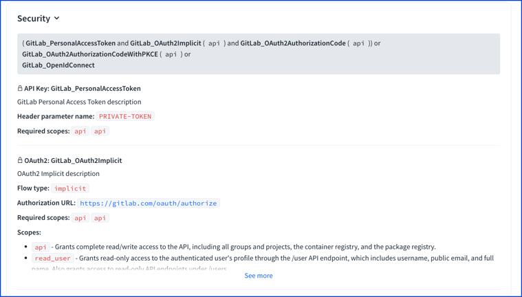
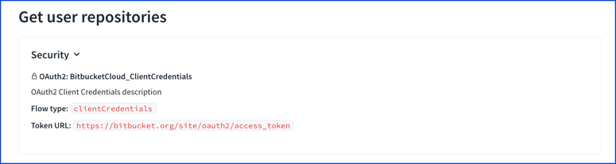
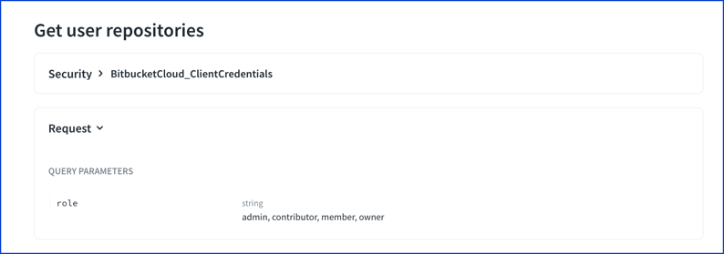
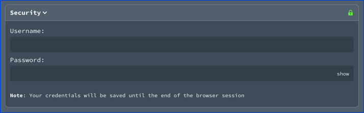
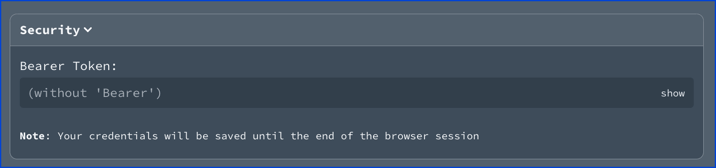
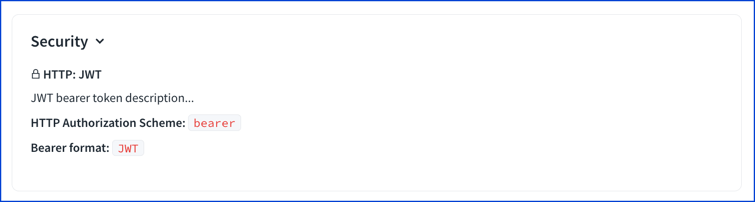
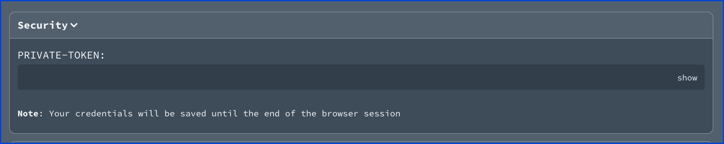

# Security schemes

<details>
<summary>
Excerpt from the OpenAPI 3.1 specification about the security scheme object
</summary>

## Security Scheme Object

Defines a security scheme that can be used by the operations.

Supported schemes are HTTP authentication, an API key (either as a header, a cookie parameter or as a query parameter), mutual TLS (use of a client certificate), OAuth2's common flows (implicit, password, client credentials and authorization code) as defined in [RFC6749](https://tools.ietf.org/html/rfc6749), and [OpenID Connect Discovery](https://tools.ietf.org/html/draft-ietf-oauth-discovery-06).
Please note that as of 2020, the implicit flow is about to be deprecated by [OAuth 2.0 Security Best Current Practice](https://tools.ietf.org/html/draft-ietf-oauth-security-topics). Recommended for most use case is Authorization Code Grant flow with PKCE.

### Fixed Fields

Field Name | Type | Applies To | Description
---|:---:|---|---
type | `string` | Any | **REQUIRED**. The type of the security scheme. Valid values are `"apiKey"`, `"http"`, `"mutualTLS"`, `"oauth2"`, `"openIdConnect"`.
description | `string` | Any | A description for security scheme. [CommonMark syntax](https://spec.commonmark.org/) MAY be used for rich text representation.
name | `string` | `apiKey` | **REQUIRED**. The name of the header, query or cookie parameter to be used.
in | `string` | `apiKey` | **REQUIRED**. The location of the API key. Valid values are `"query"`, `"header"` or `"cookie"`.
scheme | `string` | `http` | **REQUIRED**. The name of the HTTP Authorization scheme to be used in the [Authorization header as defined in RFC7235](https://tools.ietf.org/html/rfc7235#section-5.1).  The values used SHOULD be registered in the [IANA Authentication Scheme registry](https://www.iana.org/assignments/http-authschemes/http-authschemes.xhtml).
bearerFormat | `string` | `http` (`"bearer"`) | A hint to the client to identify how the bearer token is formatted.  Bearer tokens are usually generated by an authorization server, so this information is primarily for documentation purposes.
flows | [OAuth Flows Object](./oauth-flows.md) | `oauth2` | **REQUIRED**. An object containing configuration information for the flow types supported.
openIdConnectUrl | `string` | `openIdConnect` | **REQUIRED**. OpenId Connect URL to discover OAuth2 configuration values. This MUST be in the form of a URL. The OpenID Connect standard requires the use of TLS.

This object MAY be extended with [Specification Extensions](./specification-extensions.md).

### Security Scheme Object Example

#### Basic Authentication Sample

```json
{
  "type": "http",
  "scheme": "basic"
}
```

```yaml
type: http
scheme: basic
```

#### API Key Sample

```json
{
  "type": "apiKey",
  "name": "api_key",
  "in": "header"
}
```

```yaml
type: apiKey
name: api_key
in: header
```

#### JWT Bearer Sample

```json
{
  "type": "http",
  "scheme": "bearer",
  "bearerFormat": "JWT",
}
```

```yaml
type: http
scheme: bearer
bearerFormat: JWT
```

#### Implicit OAuth2 Sample

```json
{
  "type": "oauth2",
  "flows": {
    "implicit": {
      "authorizationUrl": "https://example.com/api/oauth/dialog",
      "scopes": {
        "write:pets": "modify pets in your account",
        "read:pets": "read your pets"
      }
    }
  }
}
```

```yaml
type: oauth2
flows:
  implicit:
    authorizationUrl: https://example.com/api/oauth/dialog
    scopes:
      write:pets: modify pets in your account
      read:pets: read your pets
```


</details>

## Visuals

The visuals are screenshots from the **Try it** console.

A security panel displays with each operation.



Select the security panel to expand the detailed security definition.



For operations that use multiple security schemes, Redocly displays a summary followed by the description of each security definition.
If the description is too long, Redocly displays a truncated description with a **See more** link.



### `http basic` visual

The **Try it** panel shows username and password fields with `http basic` security.



### `http bearer` visual

The following security scheme describes `http bearer` security.

```yaml
components:
  securitySchemes:
    JWT:
      description: JWT bearer token description...
      type: http
      scheme: bearer
      bearerFormat: JWT
```

The security description shows the http bearer description.



The **Try it** shows a field to enter the bearer token.



### `apiKey` visual

The following security scheme describes an `apiKey` in the header security.

```yaml
components:
  securitySchemes:
    GitLab_PersonalAccessToken:
      description: GitLab Personal Access Token description
      type: apiKey
      name: PRIVATE-TOKEN
      in: header
```

The security description shows the header parameter name.


The **Try it** panel shows the corresponding API key field.


### OAuth2 flows

See the [OAuth Flows object](./oauth-flows.md) for examples.

## Types

- `NamedSecuritySchemes` (map of strings to `SecurityScheme`)
- `SecurityScheme`
- `SecuritySchemeFlows`

```js

const SecurityScheme: NodeType = {
  properties: {
    type: { enum: ['apiKey', 'http', 'oauth2', 'openIdConnect'] },
    description: { type: 'string' },
    name: { type: 'string' },
    in: { type: 'string', enum: ['query', 'header', 'cookie'] },
    scheme: { type: 'string' },
    bearerFormat: { type: 'string' },
    flows: 'SecuritySchemeFlows',
    openIdConnectUrl: { type: 'string' },
  },
  required(value) {
    switch (value?.type) {
      case 'apiKey':
        return ['type', 'name', 'in'];
      case 'http':
        return ['type', 'scheme'];
      case 'oauth2':
        return ['type', 'flows'];
      case 'openIdConnect':
        return ['type', 'openIdConnectUrl'];
      default:
        return ['type'];
    }
  },
  allowed(value) {
    switch (value?.type) {
      case 'apiKey':
        return ['type', 'name', 'in', 'description'];
      case 'http':
        return ['type', 'scheme', 'bearerFormat', 'description'];
      case 'oauth2':
        return ['type', 'flows', 'description'];
      case 'openIdConnect':
        return ['type', 'openIdConnectUrl', 'description'];
      default:
        return ['type', 'description'];
    }
  },
  extensionsPrefix: 'x-',
};
```
