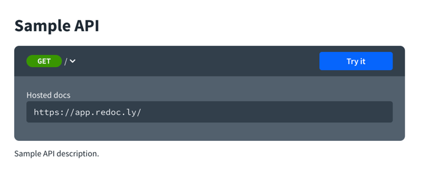
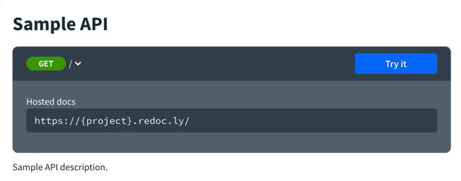
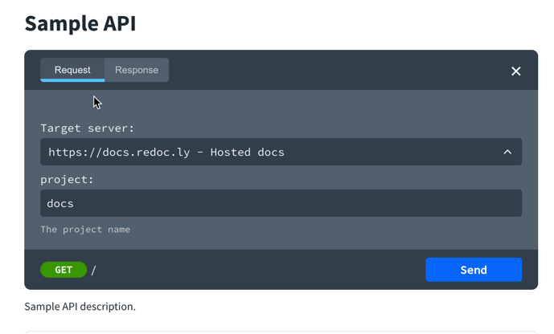

---
seo:
  title: Server variables
---
# Server `variables`

## Server variable object

Server variables are used when you need to make a substitution into the server URL such as when the subdomain is unique per tenant.


Field Name | Type | Description
---|:---:|---
default | string |  **REQUIRED**. The default value to use for substitution, which SHALL be sent if an alternate value is _not_ supplied. Note this behavior is different than the Schema Object's treatment of default values, because in those cases parameter values are optional. If the `enum` is defined, the value MUST exist in the enum's values.
enum | [string] | An enumeration of string values to be used if the substitution options are from a limited set. The array MUST NOT be empty. If defined, the array MUST contain the default value.
description | string | An optional description for the server variable.

## Visuals

The following example defines a server variable `project` with a default value of `app`.

```yaml
servers:
  - url: https://{project}.redoc.ly
    description: Hosted docs
    variables:
      project:
        default: app
        description: The project name
```

The default server variable value displays in the documentation when `expandDefaultServerVariables: true`.



The placeholder server variable value displays in the documentation when `expandDefaultServerVariables: false`.



The try it console has server variable fields regardless of that setting.



## Types

- `ServerVariable`

```ts
const ServerVariable: NodeType = {
  properties: {
    enum: {
      type: 'array',
      items: { type: 'string' },
    },
    default: { type: 'string' },
    description: null,
  },
  required: ['default'],
};
```
