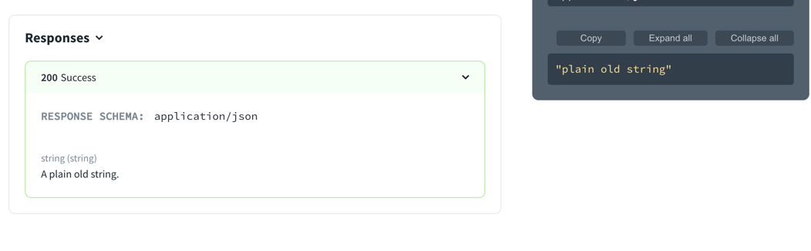
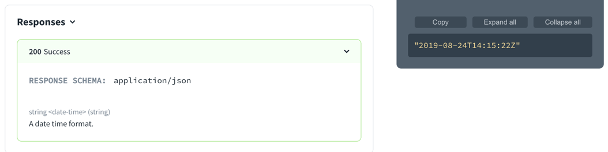
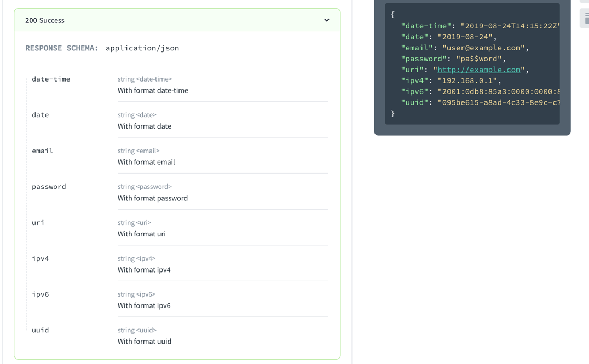

# `string`

> The string type is used for validating strings or text containing Unicode characters.

## Visuals

The following sample schema describes a string.

```yaml
type: string
description: A plain old string.
example: plain old string
```

The following image shows the string schema and corresponding example.



### String data formats

#### `date-time`

The following example shows setting the format to `date-time`.

```yaml
type: string
format: date-time
description: A date time format.
```
The following image shows the string with a date-time format and the corresponding auto-generated example.



The following image shows an object composed of strings with different formats.
#### Common formats

The following example displays an object composed of strings with all of the common string formats.

```yaml
type: object
properties:
  date-time:
    type: string
    format: date-time
    description: With format date-time
  date:
    type: string
    format: date
    description: With format date
  email:
    type: string
    format: email
    description: With format email
  password:
    type: string
    format: password
    description: With format password
  uri:
    type: string
    format: uri
    description: With format uri
  ipv4:
    type: string
    format: ipv4
    description: With format ipv4
  ipv6:
    type: string
    format: ipv6
    description: With format ipv6
  uuid:
    type: string
    format: uuid
    description: With format uuid
```
The following image shows the corresponding schema and auto-generated examples.



## Types

- SchemaProperties

```ts
const SchemaProperties: NodeType = {
  properties: {},
  additionalProperties: 'Schema',
};
```
