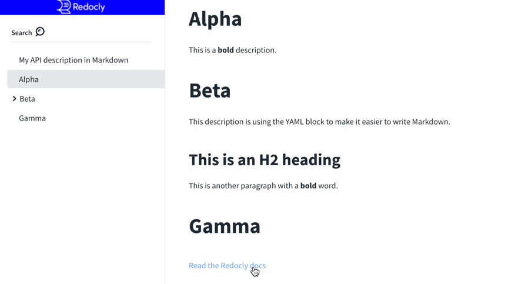
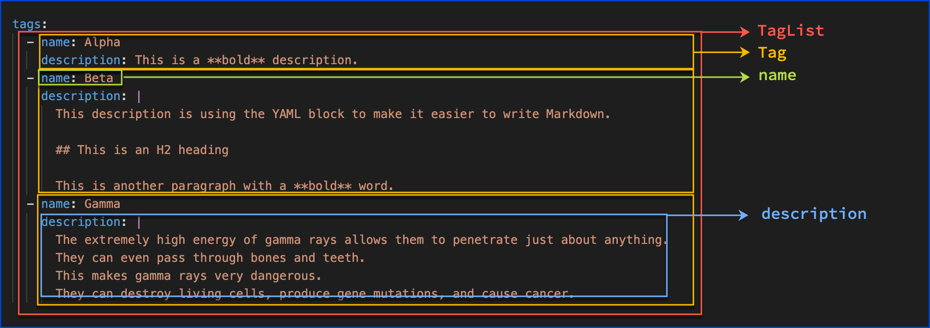

# `tags`

Type: array (sequence) of Tag objects

> A list of tags used by the document with additional metadata. The order of the tags can be used to reflect on their order by the parsing tools. Not all tags that are used by the Operation Object must be declared. The tags that are not declared MAY be organized randomly or based on the tools' logic. Each tag name in the list MUST be unique.


Field Name | Type | Description
---|:---:|---
name | `string` | **REQUIRED**. The name of the tag.
description | `string` | A description for the tag. [CommonMark syntax](https://spec.commonmark.org/) MAY be used for rich text representation.
externalDocs | [External Documentation Object](./external-docs.md) | Additional external documentation for this tag.

Redocly orders tags in the order declared in the `tags` list, followed by undeclared tags.

Further control of tag order is possible with the [`x-tagGroups` specification extension](https://redoc.ly/docs-legacy/api-reference-docs/specification-extensions/x-tag-groups/).

Furthermore, control of each tag name display is possible with the [`x-displayName` specification extension](https://redoc.ly/docs-legacy/api-reference-docs/specification-extensions/x-display-name/) and the [`x-traitTag` specification extension](https://redoc.ly/docs-legacy/api-reference-docs/specification-extensions/x-trait-tag/).


Redocly recommends using `description` instead of `externalDocs` because you can provide more context and more than one link in a `description`.


## Visuals

```yaml
tags:
  - name: Alpha
    description: This is a **bold** description.
  - name: Beta
    description: |
      This description is using the YAML block to make it easier to write Markdown.

      ## This is an H2 heading

      This is another paragraph with a **bold** word.
  - name: Gamma
    externalDocs:
      url: https://redocly.com/docs/
      description: Read the Redocly docs
```

The following screenshot shows:
- The tags display in the order they're defined.
- Like the `info.description`, if a `tag.description` has an H2, then a chevron appears in the sidebar and the H2 appears underneath the sidebar "group".
- If a tag is used in one or more operations, a chevron appears in the sidebar and the operations appear underneath the sidebar "group".
- The `externalDocs` display as a link.



## Types

- `TagList` is a list of `Tag` objects
- `Tag`

```js
const Tag: NodeType = {
  properties: {
    name: { type: 'string' },
    description: { type: 'string' },
    externalDocs: 'ExternalDocs',
  },
  required: ['name'],
};
```


