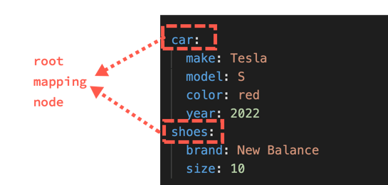

---
seo:
  title: Maps (Objects)
---
# Lesson 3: Maps



In terms of foundation, most YAML you'll encounter has a root mapping node.
In this context, "root" means it's at the top-level (root level) of the file structure.
"Mapping node" means it's a collection of data represented as a map.
A map is composed of one or more unordered nodes of keys-values.
The keys are separated from values by a colon and a space (`:`), like this example:

```yaml
ExampleKey: ExampleValue
AnotherKey: AnotherValue
```

The equivalent in JSON is called an object.

```json
{
   "ExampleKey": "ExampleValue",
   "AnotherKey": "AnotherValue"
}
```

A map is a set of unordered key-value pairs:

```yaml
Car: red
Hair: gray
```

Because maps are unordered key-value pairs, the previous map is the same as the following map:

```yaml
Hair: gray
Car: red
```

A map must have unique keys.
The keys and values are case sensitive.

```yaml OK example
hair: gray
Hair: gray
```

```yaml Bad example
hair: gray
hair: gray
```

## Flow maps

Maps can be written in a more compact way with commas separating the map items.

```yaml
{Hair: gray, Car: red}
```

This is the same as normal map style.

```yaml
Hair: gray
Car: red
```

Flow maps are less common because they're more difficult to read.

## Common problems with YAML maps (missing a space)

> The keys are separated by a colon and a space

If the space is missing, the YAML is broken.

```yaml
Car:red
```

To fix it, add a space.

```yaml
Car: red
```

## Exercise 3.1: Spot the key(s) with the problem

```text
Hair: gray
Car: red
Grass:green
Sky:blue
```

<details>
<summary>See answer</summary>

The `Grass` and `Sky` keys were missing a space after the colon.

The correct YAML is:

```yaml
Hair: gray
Car: red
Grass: green
Sky: blue
```
</details>

Looking ahead: The values (and keys) used in the example are all scalars (atomic data types). The next lesson is about [scalars](scalars.md) (the most common type of value).
