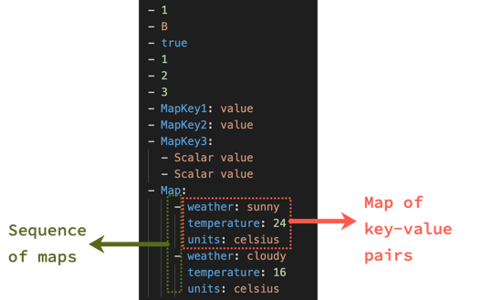
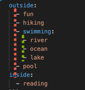

---
seo:
  title: Sequences
---
# Lesson 6: Sequences

A sequence:

- Is ordered.
- Known as a list or array in other languages.
- Looks like a bullet list.

Here is an example of a sequence:

```yaml
- 1
- 2
- 3
- 4
- 5
```

The value of each item is a number.

Here is another example of a sequence with string values:

```yaml
- A
- B
- C
- D
- E
```

Here is another sequence with mixed values:

```yaml
- 1
- B
- C
- 4
- E
```

## How to map scalars to sequences

A scalar value can map to a sequence.
This is common with a one-to-many data relationship.
The following example demonstrates this by mapping the family of fruit to various specific types of fruit.

```yaml
citrus:
  - orange
  - lemon
  - lime
stone:
  - peach
  - plum
  - cherry
```

The indentation isn't required when mapping scalars to sequences.

This is the exact same value as shown above.
```yaml
citrus:
- orange
- lemon
- lime
stone:
- peach
- plum
- cherry
```

Indent each line to at least the level of the mapping key.

The following example would be wrong because the sequence isn't part of the citrus map.

```yaml Wrong
  citrus:
- orange
- lemon
- lime
```
```yaml Right (no extra spaces)
  citrus:
  - orange
  - lemon
  - lime
```
```yaml Also right (two indent spaces)
  citrus:
    - orange
    - lemon
    - lime
```

Regardless of your indentation preference, keep the sequence items (starting with `-`) at the same alignment.

```yaml Wrong
citrus:
  - orange
- lemon
  - lime
```
```yaml Right
citrus:
  - orange
  - lemon
  - lime
```

## Flow sequences

Sequences can be written in a different format with a comma (rather than line breaks and indentation) separating the values.

This a flow sequence style, and represents the same data as the regular sequence style.
```yaml Flow sequence
citrus: [orange, lemon, lime]
stone: [peach, plum, cherry]
```

```yaml Regular sequence
citrus:
  - orange
  - lemon
  - lime
stone:
  - peach
  - plum
  - cherry
```

## Complex sequences

Sequences may be composed of scalars, other sequences, and maps.
Maps can also be composed of sequences too.

This is where YAML gets complex.
**Pay extra attention to indentation.**

Sequence of scalars and sequences and maps.

```yaml
- 1
- B
- true
- 1
- 2
- 3
- MapKey1: value
- MapKey2: value
- MapKey3:
  - Scalar value
  - Scalar value
- Map:
    - weather: sunny
      temperature: 24
      units: celsius
    - weather: cloudy
      temperature: 16
      units: celsius
```



## Exercise 6.1: Which scalar maps to the sequence item

Does the `pool` sequence item map to `swimming`, `outside`, or `inside`?

```yaml
outside:
  - fun
  - hiking
  - swimming:
    - river
    - ocean
    - lake
  - pool
inside:
  - reading
```

<details>
<summary>See answer</summary>

The `pool` item belongs to the `outside` mapping key.

The indentation level of pool is at the indentation of the sequence items belonging to the `outside` map.



</details>
