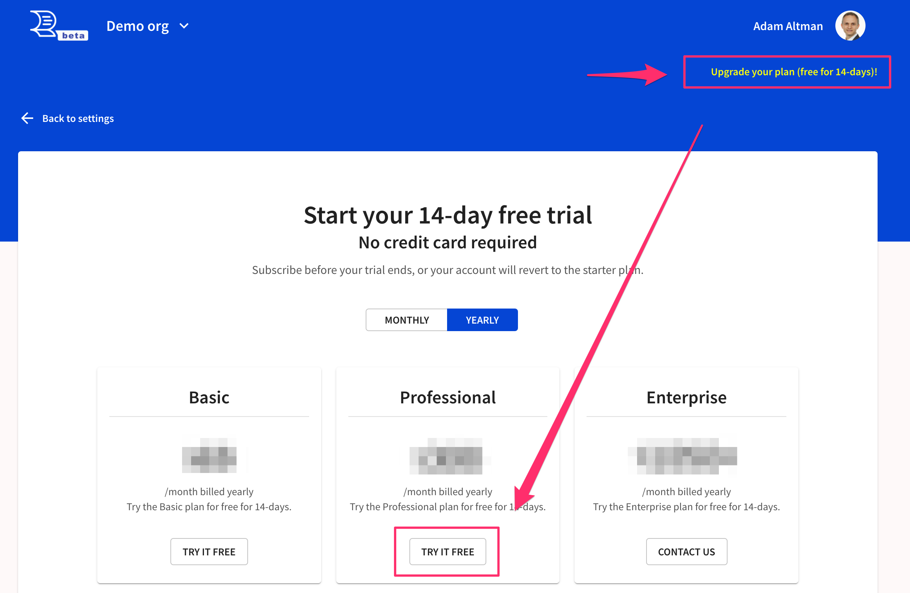
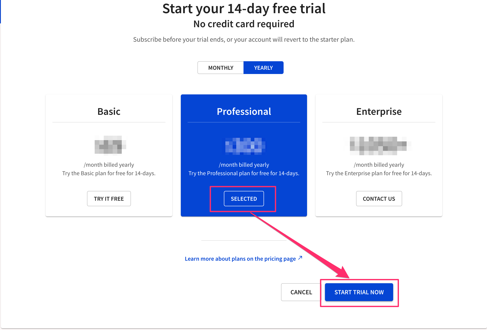
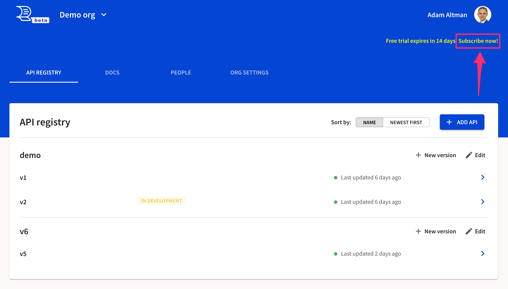
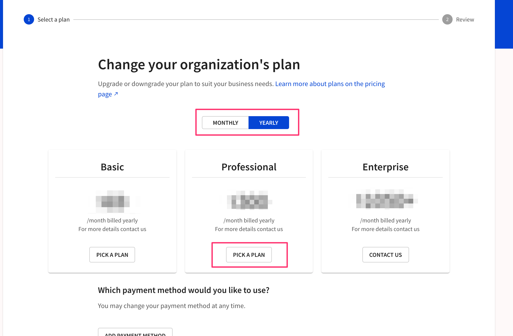
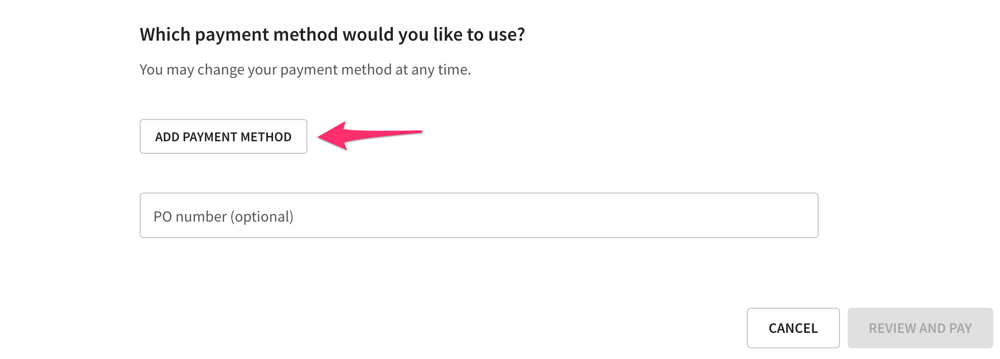

---
seo:
  title: Signup process
slug: /billing/signup
---

# Signup process

## Signup

Visit our [signup form](https://auth.cloud.redocly.com/registration) to get started.
If you use the email/password signup option, you will receive an email to verify your email address.

## Create an organization

When you first login, you will be prompted to create an organization.
The organization will start on our free "starter" plan.

## Start your trial

Upgrade to get more features such as public docs, custom domains and developer portals.

There is a link to upgrade visible in the top navigation.

The premium plans have a free-trial period.
Select your trial.

## Subscribe

You may subscribe at any time during your trial period.
You will not be charged until the trial period is over.

Click "subscribe now" in the top navigation.

Pick your plan.

Enter your payment method.
We accept payments cards.
We can invoice for payment for balances over $3,000 and can receive check, ACH or wire transfer.
You may add a PO.
It will appear on the invoice.
We do not accept a PO as a form of payment.

